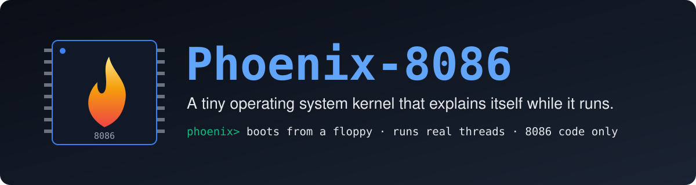
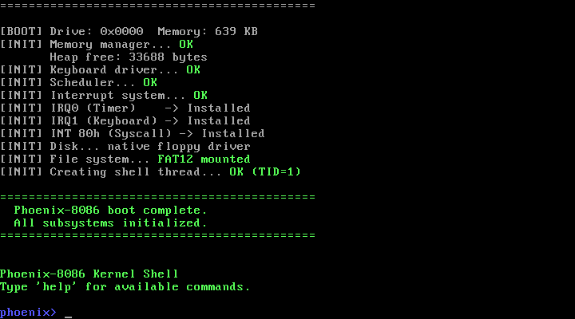
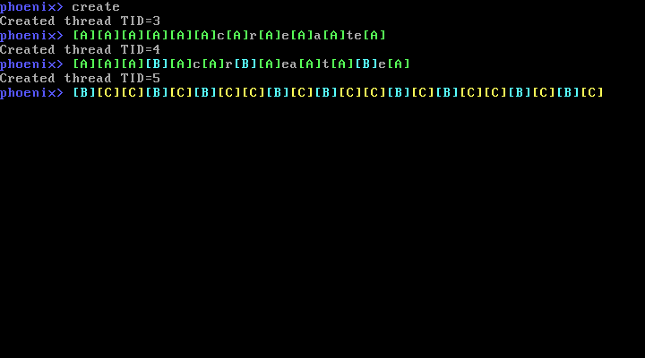
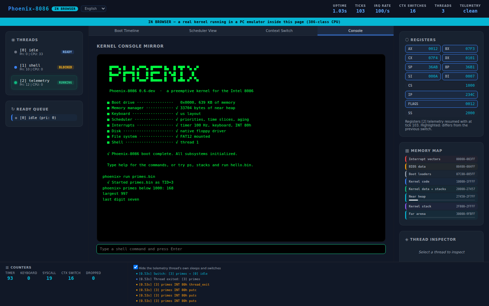
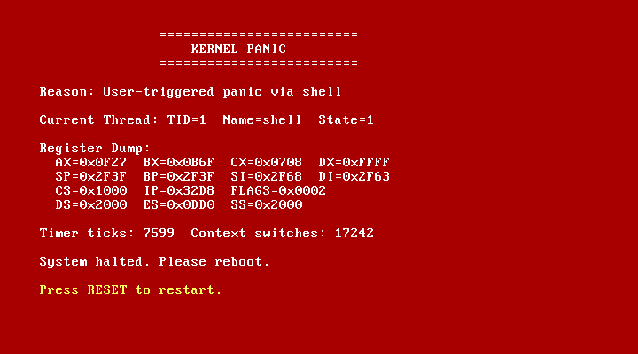
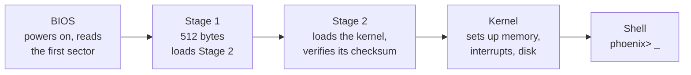
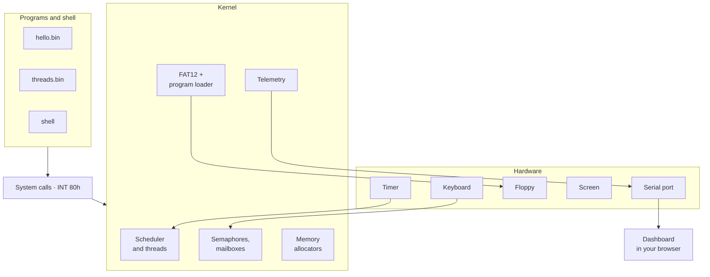
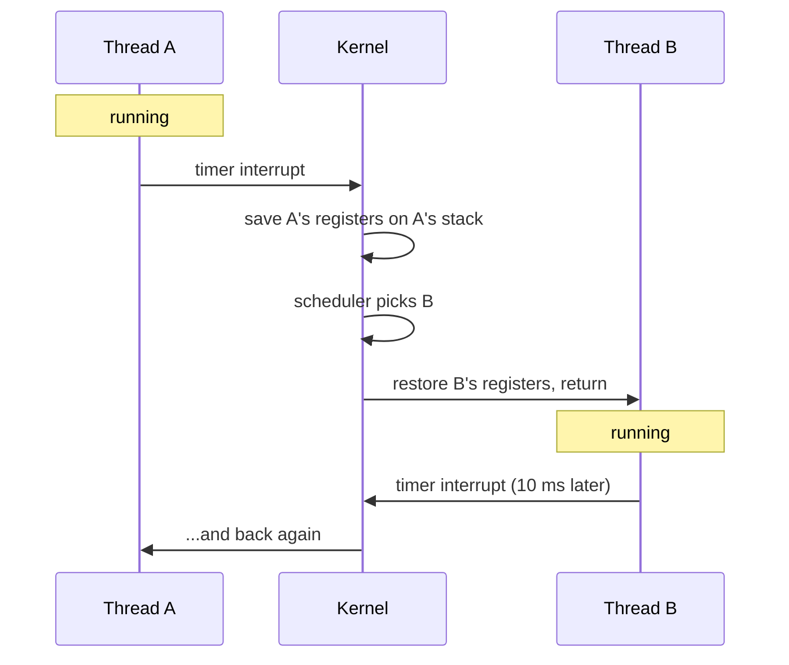
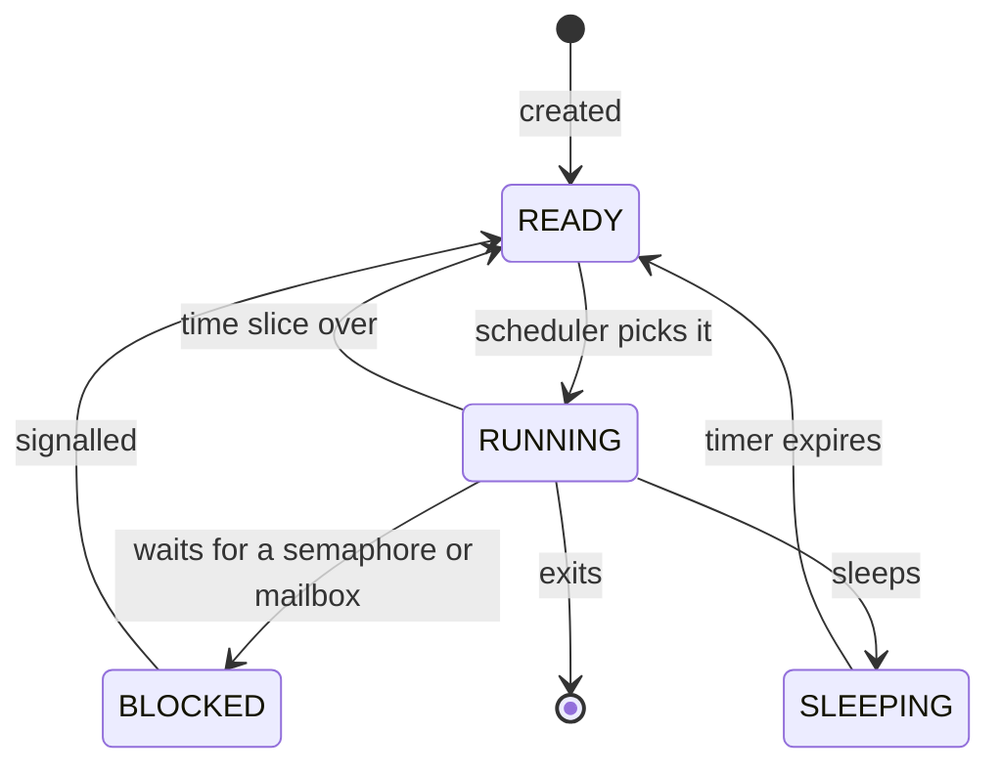

<p align="center">
  
</p>

<p align="center">
  <a href="https://github.com/khandakerCodes/PHOENIX_8086/actions/workflows/ci.yml"></a>
  <a href="LICENSE"></a>
  
  
  
  
  <a href="CONTRIBUTING.md"></a>
</p>

<p align="center">
  <b><a href="#-quick-start">Quick start</a></b> ·
  <b><a href="#-your-first-five-minutes">Take the tour</a></b> ·
  <b><a href="docs/manual.md">User manual</a></b> ·
  <b><a href="#-how-it-works">How it works</a></b> ·
  <b><a href="docs/labs/README.md">Labs</a></b> ·
  <b><a href="#-contributing">Contribute</a></b>
</p>

---

**Phoenix-8086** is a small operating system kernel for the 1978 Intel 8086 processor. It boots from a floppy disk image with no DOS underneath, runs several threads at once, loads programs from a disk, and reports everything it does to a live dashboard, so you can *watch* an operating system work instead of only reading about one.

It is built for people learning how operating systems work, for teachers who want something small enough to show in a lecture, and for anyone who likes old machines.

> [!NOTE]
> **Status: pre-alpha.** The kernel works and is tested on every change, in emulators. It has not run on real hardware yet. See [Known limitations](#-known-limitations).

<table>
  <tr>
    <td width="50%"></td>
    <td width="50%"></td>
  </tr>
  <tr>
    <td align="center"><sub>Booting to the shell</sub></td>
    <td align="center"><sub>Three threads sharing one processor</sub></td>
  </tr>
  <tr>
    <td></td>
    <td></td>
  </tr>
  <tr>
    <td align="center"><sub>The dashboard, with the kernel running inside the browser</sub></td>
    <td align="center"><sub>A panic, with the registers at the moment it happened</sub></td>
  </tr>
</table>

## 📖 Contents

- [What you get](#-what-you-get)
- [Quick start](#-quick-start)
- [Your first five minutes](#-your-first-five-minutes)
- [Ways to run it](#-ways-to-run-it)
- [Write your first program](#-write-your-first-program)
- [How it works](#-how-it-works)
- [Is it really 8086 code?](#-is-it-really-8086-code)
- [How it is tested](#-how-it-is-tested)
- [Glossary](#-glossary)
- [Known limitations](#-known-limitations)
- [Documentation](#-documentation)
- [Roadmap](#-roadmap)
- [Contributing](#-contributing)
- [License and credits](#-license-and-credits)

## ✨ What you get

| | Feature | What it means |
| --- | --- | --- |
| 🥾 | **Two-stage bootloader** | The machine starts from a 512-byte boot sector that loads the rest, checks it, and jumps in. No DOS involved. |
| 🧵 | **Real multitasking** | Several threads share one processor. A timer interrupts 100 times a second and the kernel decides who runs next. |
| ⚖️ | **A fair scheduler** | Higher priorities go first, equal priorities take turns, and anything kept waiting slowly gains priority so it cannot starve. |
| 🚦 | **Blocking and messaging** | Semaphores, mutexes and mailboxes let threads wait for each other without wasting processor time. Mutexes use priority inheritance, so a low-priority thread holding a lock cannot hold up a high-priority one for long. |
| 📞 | **System calls** | Programs ask the kernel for services through `INT 80h`, the same idea Linux used on the PC. |
| 💾 | **A real file system** | The boot floppy is a standard FAT12 disk. The kernel reads it with its own floppy-controller driver. |
| 🚀 | **Loadable programs** | Write a C program with the SDK, put it on the disk, and `run` it. Each program gets memory of its own. |
| 🧯 | **Safety nets** | A runaway thread is stopped before it damages another, whether it is a kernel thread or a program. Bad system-call arguments are refused. A crash shows a panic screen with the processor's registers. |
| 📊 | **A live dashboard** | A web page shows threads, context switches, registers and memory as they happen, in five languages. |
| 🌐 | **Runs in a browser** | The whole thing, kernel included, can run inside a web page with nothing installed. |
| 🔬 | **Honest 8086 code** | Every build is checked for instructions newer than the 8086, and the kernel is tested on an emulated 8086. |

## 🚀 Quick start

You need Linux on a 64-bit PC. Ubuntu 24.04 is what the project is developed and tested on; Windows users can use WSL2.

```sh
# 1. Tools
sudo apt install make nasm python3 curl qemu-system-x86

# 2. Get the code and its compiler (the compiler is about 200 MB, no root needed)
git clone https://github.com/khandakerCodes/PHOENIX_8086.git
cd PHOENIX_8086
make toolchain

# 3. Build it and boot it
make run
```

A window opens, the kernel boots, and you get a prompt:

```
phoenix> _
```

Type `help` and press Enter. To make sure everything is healthy, run `make test`.

<details>
<summary><b>Not on Ubuntu 24.04?</b></summary>

`make toolchain` downloads compiler packages built for Ubuntu 24.04. On other systems, install `gcc-ia16-elf` yourself from [tkchia/build-ia16](https://github.com/tkchia/build-ia16); the build uses `ia16-elf-gcc` from your `PATH` when there is no `.toolchain/` folder. macOS and other Linux distributions should work but have not been verified. Details are in [docs/building.md](docs/building.md).
</details>

## 🎒 Your first five minutes

Everything below is real output from the kernel, trimmed a little. Type the part after `phoenix>`.

### 1. Watch three threads share the processor

```
phoenix> create
Created thread TID=3
phoenix> create
Created thread TID=4
phoenix> create
Created thread TID=5
phoenix> [B][C][C][B][C][B][C][C][B][C][B][C][C][B][C][B][C][C]...
```

Each thread prints its own letter (A, B and C). They have different priorities, yet they take turns and all of them finish: that is the scheduler at work. Their output lands wherever the cursor is, so expect it mixed in with your typing. While they run, type `ps` to see who is doing what.

### 2. See what is running

```
phoenix> ps
=== Thread List ===
  TID  Name          State      Pri  CPU Ticks
  ---  ----          -----      ---  ---------
  0    idle          READY      0    5656
  1    shell         RUNNING    10    4
  2    telemetry     SLEEPING   12    7
```

`idle` runs when nobody else wants the processor, `shell` is what you are typing into, and `telemetry` reports to the dashboard.

### 3. Run programs from the disk

```
phoenix> ls
  README.TXT    271 bytes
  HELLO.BIN     188 bytes
  PRIMES.BIN    456 bytes
  CLOCK.BIN     446 bytes
  THREADS.BIN   636 bytes
  WHERE.BIN     373 bytes
  GREET.BIN     242 bytes
  ROGUE.BIN     898 bytes
8 file(s)

phoenix> run hello.bin
Started hello.bin as TID=3
Hello from a program loaded off the disk!
System call ABI version 1

phoenix> run where.bin
Started where.bin as TID=3
where: cs=3001 ds=3011 ss=3011
where: 50000 bytes of my own, zeroed and writable
```

`where.bin` shows that a program gets its own code segment (`cs`) and its own data segment (`ds`), separate from the kernel's.

### 4. Watch threads talk to each other

```
phoenix> ipc
Created thread TID=3
Created thread TID=4
[recv 1][recv 2][recv 3][recv 4][recv 5][ipc done]
```

One thread sends numbers into a mailbox and another receives them. The receiver sleeps whenever the mailbox is empty.

### 5. Break it on purpose

```
phoenix> overflow
Created thread TID=3

!!! STACK OVERFLOW: Thread 3 (overflow) !!!
```

A thread that recurses forever is caught and stopped, and the shell carries on. For the full red screen, type `panic`.

A program can misbehave too:

```
phoenix> run rogue.bin
Started rogue.bin as TID=3
rogue: 9 of 9 bad calls refused
rogue: now overflowing my own stack

!!! PROGRAM STACK OVERFLOW: Thread 3 (rogue) !!!
```

The kernel refuses every system call that hands it memory the program does not own, then catches the program's own stack overflowing. The 8086 has no memory protection, so this is detection, not protection.

More to try: `stacks`, `memory`, `stats`, `bench`, `selftest`, `cpu`, `keymap de`. Every command is explained in the **[user manual](docs/manual.md)**.

## 🖥️ Ways to run it

| I want to… | Command | Notes |
| --- | --- | --- |
| Use it in a window | `make run` | QEMU. Close the window to stop. |
| Check everything works | `make test` | Builds, checks the instruction set, boots the kernel and types commands into it. |
| Run it on an 8086 | `make test-8086` | Needs `sudo apt install dosbox-x`. Boots the same disk on an emulated 8086. |
| See the dashboard | `./phoenix.sh` | Needs `pip install -r bridge/requirements.txt`. Then open <http://localhost:8080>. |
| Run it in a browser | `./tools/build_site.sh` | Then `python3 -m http.server 8080 --directory site`. The kernel runs inside the page. |
| Stress it | `make soak SOAK_SECONDS=600` | Ten minutes of constant thread and program churn, checking for leaks. |
| Debug it | `make debug` | QEMU waits for GDB on port 1234. |
| Study a session in Perfetto | `python3 -m bridge.trace session.jsonl -o session.json` | Converts a capture (from `--capture` or `tools/record_session.py`); open the file at <https://ui.perfetto.dev>. |
| Check the size budget | `make size` | How full each 64 KB segment is; fails past 90%. |

The dashboard always tells you where its data comes from:

| Badge | Meaning |
| --- | --- |
| 🟢 **LIVE** | A running kernel, relayed over its serial port |
| 🟣 **REPLAY** | A recorded session played back |
| 🔵 **IN BROWSER** | The kernel running in an emulator inside the page |
| 🟡 **DEMO** | Simulated data, shown only if you press "Run demo" |
| 🔴 **OFFLINE** | No data source; the panels say so instead of showing made-up numbers |

## 🧑‍💻 Write your first program

Programs are ordinary C files built with the SDK in `sdk/`. This is `sdk/examples/greet.c`, one of the examples on the disk:

```c
#include "phoenix.h"

int main(void)
{
    px_puts("What is your favourite number? ");
    char digit = px_getc();          /* waits for a key */
    px_putc(digit);
    px_puts("\nGood choice. Counting to three:\n");

    for (char n = '1'; n <= '3'; n++) {
        px_sleep(PX_HZ / 2);         /* half a second; other threads run meanwhile */
        px_putc(n);
        px_putc('\n');
    }
    return 0;
}
```

```
phoenix> run greet.bin
Started greet.bin as TID=3
What is your favourite number? 7
Good choice. Counting to three:
1
2
3
```

To make your own:

**1. Copy it.**

```sh
cp sdk/examples/greet.c sdk/examples/mine.c
```

**2. Add it to the build.** In the `Makefile`, add `mine` to this line:

```make
PROGRAM_NAMES = hello primes clock threads where greet rogue mine
```

**3. Build, boot, run.**

```sh
make run
```

```
phoenix> run mine.bin
```

The build compiles your file, packs it into `MINE.BIN`, and copies it onto the floppy image. `sdk/include/phoenix.h` lists everything a program can ask the kernel for: console, time, threads, semaphores, mailboxes, memory and files. There is no C library, so no `printf`; the examples show how to manage without. The guide is [docs/programs.md](docs/programs.md).

## 🔧 How it works

### From power-on to prompt



### The pieces



### One processor, many threads

The trick behind multitasking is the **context switch**. Every thread has its own stack. When the timer interrupts, the kernel saves the running thread's registers on that thread's stack, picks another thread, and restores *its* registers instead.



A thread is always in one of these states:



### Where things live in memory

| Address | Contents |
| --- | --- |
| `00000`–`003FF` | Interrupt vector table: where the processor looks up each interrupt handler |
| `07C00`–`085FF` | The two boot loaders |
| `10000`–`1FFFF` | Kernel code |
| `20000`–`2FFFF` | Kernel data, thread stacks and the kernel's heap |
| `30000`–`9FFFF` | Free memory handed out to programs |
| `B8000` | The text screen |

The full story, file by file, is in [docs/architecture.md](docs/architecture.md).

## 🔬 Is it really 8086 code?

The 8086 has no memory protection, no 32-bit registers, and lacks instructions that every later x86 chip has. It is easy to write code that *claims* to be for the 8086 and quietly is not. Three checks keep this project honest, on every change:

1. **Static check.** `make check` disassembles the kernel and every example program and fails on any instruction the 8086 does not have. The boot sectors are assembled with NASM's `CPU 8086`.
2. **Dynamic check.** `make test-8086` boots the disk on DOSBox-X configured as an 8086 and runs the self-tests, the threading demos, the programs and the file system there.
3. **Control.** The kernel's `cpu` command works out which processor it is on, using only 8086 instructions. It answers `8086/8088` on the emulated 8086 and `80286 or later` under QEMU, which shows the two test environments really are different machines.

## 🧪 How it is tested

Every push runs all of this on GitHub's servers.

| Suite | What it does | Size |
| --- | --- | --- |
| Instruction check | Rejects any non-8086 instruction | 10,417 kernel instructions, plus every example program |
| Host-compiled kernel tests | Kernel synchronisation, mailboxes, allocators and FAT12 built for the PC with sanitizers; a fuzzer feeds the FAT12 driver thousands of corrupted floppies | 2,300+ checks, 81% line coverage of those files |
| In-kernel self-test | The kernel tests its own allocators, semaphores, mutexes and priority inheritance, mailboxes, timers, system calls, file system and keyboard layouts | 79 assertions |
| Size budget | Fails if either 64 KB segment passes 90% full; the report goes in the CI summary | Every push |
| Integration test | Boots the kernel in QEMU and types commands into it, checking the screen and the telemetry | Over 70 checks across 5 boots |
| 8086 fidelity test | The same on an emulated 8086 | 16 checks |
| Soak test | Constant churn of threads and programs; fails on any leak, crash or lost record | 90 s per push, 1 hour nightly |
| Host unit tests | Protocol decoders, bridge, trace export, dashboard logic and page code | 91 tests |
| Browser test | Opens the dashboard and the in-browser kernel in headless Chromium, with an accessibility audit | Over 30 checks |

Some honest numbers: the kernel and boot loaders are about **8,600 lines** of C and assembly, and the kernel builds to **34 KB**. A 15-minute soak run made 27,611 context switches without a leak or a lost telemetry record.

> [!IMPORTANT]
> The `bench` command reports how fast context switches are and how long the timer interrupt takes to arrive, but it measures the *emulator*, not an 8086. Do not quote its numbers as hardware performance. Under QEMU the interrupt latency is especially unrealistic (hundreds of microseconds), because QEMU raises the timer interrupt later than its emulated timer chip wraps.

## 📚 Glossary

New to operating systems? These are the words this project uses.

<details>
<summary><b>Kernel</b></summary>
The core program of an operating system. It owns the hardware and shares it out among everything else that runs.
</details>

<details>
<summary><b>Intel 8086</b></summary>
A 16-bit processor from 1978 and the ancestor of today's PC processors. It can address one megabyte of memory and has no way to stop one program from overwriting another.
</details>

<details>
<summary><b>Bootloader</b></summary>
The tiny program the machine runs first. Its only job is to load the kernel from disk and start it. Here it comes in two stages because the first must fit in 512 bytes.
</details>

<details>
<summary><b>Thread</b></summary>
One independent sequence of instructions with its own stack. The kernel runs several by switching between them quickly.
</details>

<details>
<summary><b>Scheduler</b></summary>
The part of the kernel that decides which thread runs next.
</details>

<details>
<summary><b>Preemptive multitasking</b></summary>
The kernel takes the processor away from a thread when its time is up, whether or not the thread cooperates. The alternative, cooperative multitasking, relies on every thread giving up the processor voluntarily.
</details>

<details>
<summary><b>Context switch</b></summary>
Saving one thread's registers and restoring another's, so the second thread continues exactly where it left off.
</details>

<details>
<summary><b>Interrupt</b></summary>
A signal that makes the processor drop what it is doing and run a handler: a timer tick, a key press, the disk finishing a read, or a program asking for a service.
</details>

<details>
<summary><b>System call</b></summary>
How a program asks the kernel to do something for it, such as printing or reading a file. Here it is the instruction <code>INT 80h</code>.
</details>

<details>
<summary><b>Semaphore, mutex, mailbox</b></summary>
Tools for threads to coordinate. A <b>semaphore</b> is a counter a thread can wait on. A <b>mutex</b> lets only one thread into a section of code at a time. A <b>mailbox</b> is a queue of messages between threads.
</details>

<details>
<summary><b>Segment</b></summary>
On the 8086, memory is addressed as a segment plus an offset, written <code>segment:offset</code>. Each is 16 bits, and together they reach one megabyte.
</details>

<details>
<summary><b>Real mode</b></summary>
The 8086's only mode of operation: every program can reach all memory and all hardware. Later processors added a "protected mode"; this kernel does not use it.
</details>

<details>
<summary><b>FAT12</b></summary>
The file system used on floppy disks since the early 1980s. Any operating system can still read it.
</details>

<details>
<summary><b>Kernel panic</b></summary>
What a kernel does when it finds itself in a state it cannot recover from: it stops and shows what it knows.
</details>

<details>
<summary><b>Telemetry</b></summary>
The stream of small records the kernel sends over its serial port describing what it is doing. The dashboard is drawn from nothing else.
</details>

<details>
<summary><b>Emulator</b></summary>
A program that imitates a computer. QEMU, DOSBox-X and v86 are the three used here.
</details>

## ⚠️ Known limitations

- **No real hardware yet.** Everything runs in emulators. `make test-8086` uses DOSBox-X's 8086 mode, which that project calls experimental; it is not cycle-accurate.
- **No memory protection.** That is the nature of the 8086. A program has its own memory but nothing stops it writing elsewhere.
- **Read-only file system**, root directory only.
- **Stack overflows are caught, not prevented.** Kernel and program stacks are checked at every thread switch; a fast enough runaway can damage memory next to its stack before it is stopped. A program can have at most four threads.
- **The dashboard is tested in Chromium only**, at desktop and phone sizes with an automated accessibility audit. Other browsers and real screen readers have not been tried.
- **Translations need review.** The dashboard's German, French, Spanish and Arabic texts were not written or checked by native speakers.
- **Interfaces can still change.** The system-call numbers and the telemetry protocol are not frozen before version 1.0.

## 📂 Documentation

| Document | For |
| --- | --- |
| **[User manual](docs/manual.md)** | Using the kernel: every command, the programs, the dashboard, troubleshooting |
| [Building and running](docs/building.md) | Toolchain, build targets, emulators, debugging |
| [Architecture](docs/architecture.md) | How each part works and where it lives in the source |
| [Writing programs](docs/programs.md) | The SDK and how programs are loaded |
| [System calls](docs/syscalls.md) | The `INT 80h` reference |
| [Telemetry protocol](docs/telemetry.md) | What the kernel sends to the dashboard |
| [Labs](docs/labs/README.md) | Three guided exercises, with solutions |
| [Translating](docs/translating.md) | Adding a language or a keyboard layout |
| [Specification](projectdetails.md) · [Plan](implementation_plan.md) · [Upscaling plan](UPSCALING.md) · [Changelog](CHANGELOG.md) | Where the project is going and what changed |

<details>
<summary><b>Repository layout</b></summary>

| Path | Contents |
| --- | --- |
| `boot/` | Stage 1 boot sector and Stage 2 loader (NASM) |
| `kernel/` | Kernel sources (C and GNU assembler) |
| `include/` | Shared types and the memory layout |
| `linker/` | Kernel linker script |
| `sdk/` | Header, startup code, linker script and builder for programs, with examples |
| `disk/` | Files copied onto the boot floppy |
| `tools/` | Toolchain fetcher, image builders, instruction-set check, tests |
| `bridge/` | Telemetry decoder, capture files, serial-to-WebSocket bridge (Python) |
| `dashboard/` | Web dashboard |
| `docs/` | Everything in the table above |
</details>

## 🗺️ Roadmap

| Version | Theme | Status |
| --- | --- | --- |
| 0.2 | Repository, CI, honest docs | ✅ Done |
| 0.3 | True 8086 code | ✅ Done |
| 0.4 | Real multitasking | ✅ Done |
| 0.5 | Truthful dashboard | ✅ Done |
| 0.6 | Programs from disk | ✅ Done, not yet tagged |
| 0.9 | Hardening and translations | 🚧 In progress |
| 1.0 | Public launch, stable interfaces | ⏳ Planned |
| 1.x | Real hardware, writable file system, more layouts and languages | 💭 Ideas |

The detailed status of every item is in the [implementation plan](implementation_plan.md).

## 🤝 Contributing

Contributions are welcome, and the kernel is small enough to understand completely. Good places to start:

- 🌍 Review a dashboard translation if you are a native speaker
- ⌨️ Add a keyboard layout ([lab 3](docs/labs/03-keyboard-layout.md) shows how)
- 🖥️ Try the build on macOS or another Linux distribution and report back
- 🧪 Work through a [lab](docs/labs/README.md) and tell us where it was unclear
- 🔌 Boot it on a real XT-class machine

Read [CONTRIBUTING.md](CONTRIBUTING.md) first; `make test` must pass before a pull request. This project follows a [code of conduct](CODE_OF_CONDUCT.md). To report a security problem in the host-side tools, see [SECURITY.md](SECURITY.md).

## 📜 License and credits

Phoenix-8086 is released under the [MIT License](LICENSE).

It stands on other people's work:

- [gcc-ia16](https://github.com/tkchia/gcc-ia16), the C compiler for 16-bit x86, maintained by TK Chia
- [NASM](https://www.nasm.us), the assembler used for the boot sectors
- [QEMU](https://www.qemu.org), [DOSBox-X](https://dosbox-x.com) and [v86](https://github.com/copy/v86), the emulators it is developed and tested on
- [Playwright](https://playwright.dev) and [axe-core](https://github.com/dequelabs/axe-core), which test the dashboard

<p align="center"><sub>Built for learning. Break it, read it, change it.</sub></p>
