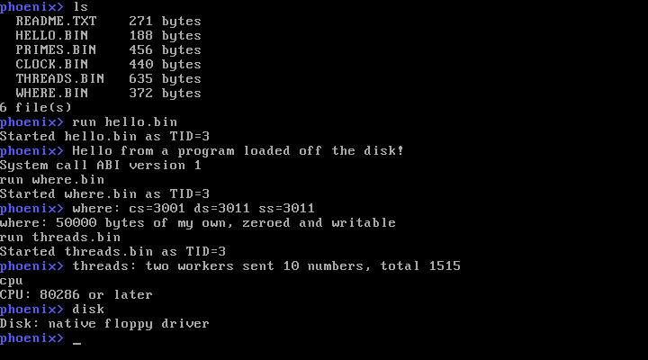
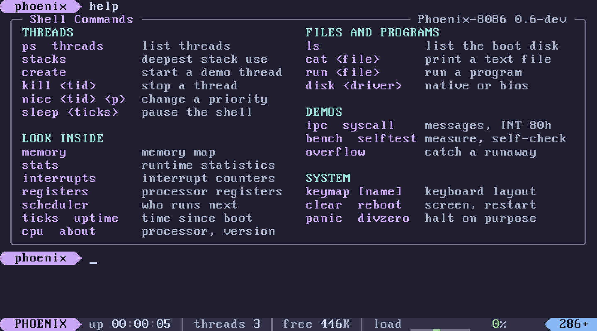
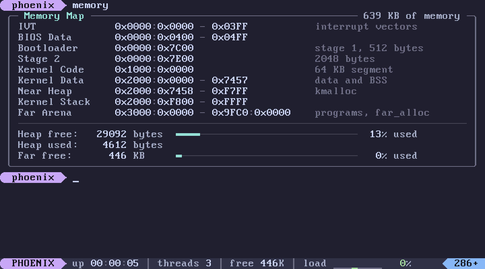
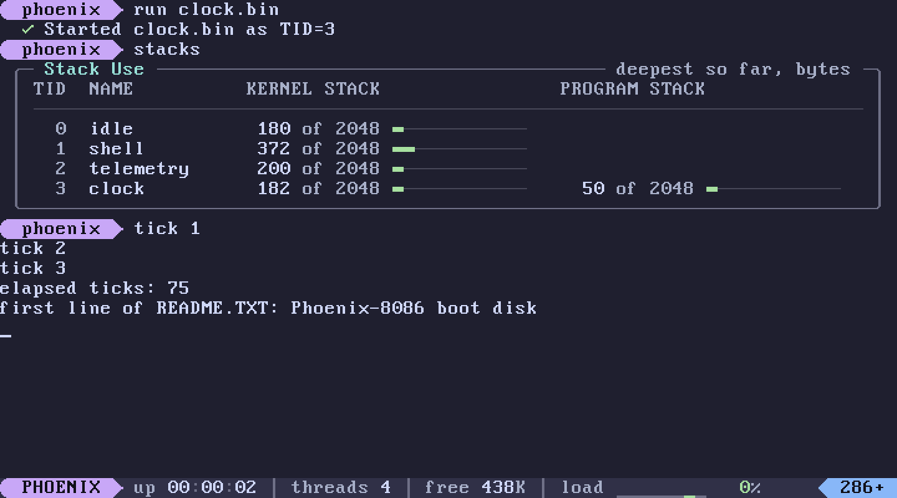
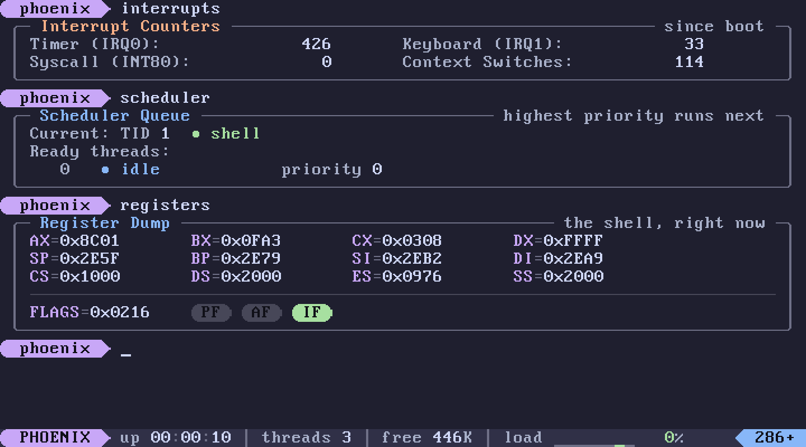
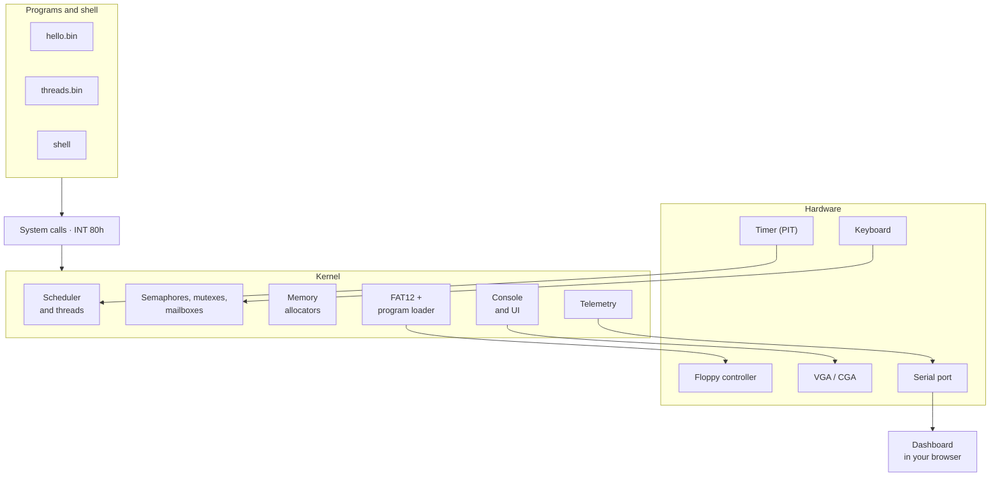
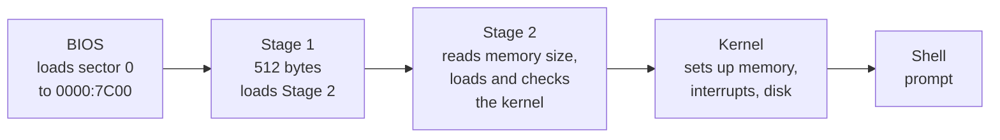
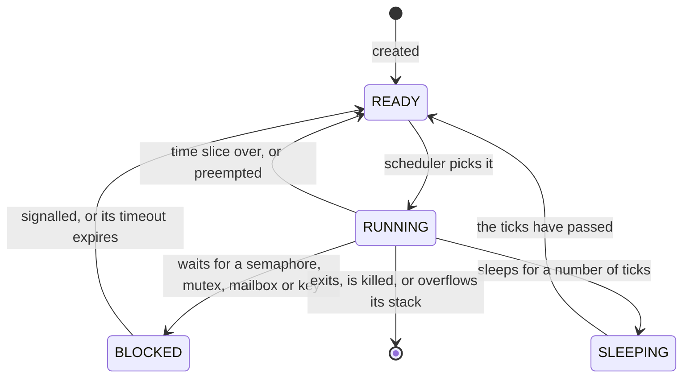
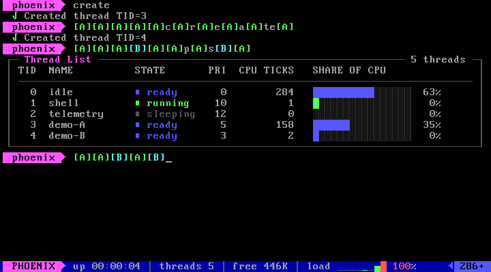

<p align="center">
  
</p>

<p align="center">
  <a href="https://github.com/khandakerCodes/PHOENIX_8086/actions/workflows/ci.yml"></a>
  <a href="LICENSE"></a>
  
  
  
  
  <a href="CONTRIBUTING.md"></a>
</p>

<p align="center">
  <b><a href="#quick-start">Quick start</a></b> ·
  <b><a href="#your-first-five-minutes">Take the tour</a></b> ·
  <b><a href="docs/manual.md">User manual</a></b> ·
  <b><a href="#how-it-works">How it works</a></b> ·
  <b><a href="docs/labs/README.md">Labs</a></b> ·
  <b><a href="#contributing">Contribute</a></b>
</p>

---

**Phoenix-8086** is a preemptive, multithreaded operating system kernel for the Intel 8086, the 16-bit processor of the original IBM PC. It boots from a 1.44 MB floppy image with no DOS underneath, schedules threads by priority, loads separately compiled programs from a FAT12 file system, and reports every scheduling decision, interrupt and fault over its serial port to a live dashboard. The aim is that you can *watch* an operating system work instead of only reading about one.

It is written in C and assembly, uses only instructions the 8086 has (checked on every build), and is small enough to read in full: about 9,300 lines of kernel and 450 lines of boot loader.

It is built for people learning how operating systems work, for teachers who want something small enough to show in a lecture, and for anyone who likes old machines.

> [!NOTE]
> **Status: pre-alpha.** The kernel works and is tested on every change, in three emulators. It has not yet run on a physical 8086 or 8088. Interfaces may still change before 1.0. See [Known limitations](#known-limitations).

<table>
  <tr>
    <td width="50%"></td>
    <td width="50%"></td>
  </tr>
  <tr>
    <td align="center"><sub>Boot: each subsystem checked off, then the prompt and status bar</sub></td>
    <td align="center"><sub>Threads sharing one processor, <code>ps</code>, and the load sparkline</sub></td>
  </tr>
  <tr>
    <td></td>
    <td></td>
  </tr>
  <tr>
    <td align="center"><sub>The FAT12 boot disk, and a program loaded from it</sub></td>
    <td align="center"><sub>A kernel panic: the reason, the thread, the registers</sub></td>
  </tr>
  <tr>
    <td colspan="2"></td>
  </tr>
  <tr>
    <td colspan="2" align="center"><sub>The dashboard, with the kernel running in an emulator inside the page</sub></td>
  </tr>
</table>

## Contents

- [What you get](#what-you-get)
- [At a glance](#at-a-glance)
- [Quick start](#quick-start)
- [Your first five minutes](#your-first-five-minutes)
- [Ways to run it](#ways-to-run-it)
- [Write your first program](#write-your-first-program)
- [How it works](#how-it-works)
- [Is it really 8086 code?](#is-it-really-8086-code)
- [How it is tested](#how-it-is-tested)
- [Glossary](#glossary)
- [Known limitations](#known-limitations)
- [Documentation](#documentation)
- [Roadmap](#roadmap)
- [Contributing](#contributing)
- [License and credits](#license-and-credits)

## What you get

| | Feature | What it means |
| --- | --- | --- |
| ▸ | **Two-stage bootloader** | A 512-byte boot sector loads a 2 KB second stage, which loads the kernel, verifies its checksum and jumps to it. No DOS is involved. |
| ▸ | **Preemptive multitasking** | Up to eight threads share the processor. The timer interrupts 100 times a second and the kernel decides, at every interrupt, which thread runs next. |
| ▸ | **A fair priority scheduler** | Higher priority runs first; equal priorities take turns in 50 ms slices; a thread kept waiting gains priority over time (aging), so none can starve. |
| ▸ | **Blocking synchronisation** | Counting semaphores, mutexes and mailboxes suspend a waiting thread instead of spinning. Mutexes use priority inheritance, which bounds priority inversion. |
| ▸ | **System calls** | 23 kernel services through `INT 80h`, with every argument from a program checked before use. |
| ▸ | **A real file system** | The boot floppy is a standard FAT12 volume that any operating system can read. The kernel drives the floppy controller itself, with DMA, and falls back to the BIOS. |
| ▸ | **Loadable programs** | Write C with the SDK, put it on the disk, and `run` it. Each program gets a code segment and a data segment of its own, and can start threads of its own. |
| ▸ | **Safety nets** | Stack overflows are caught at the next thread switch, for kernel threads and programs alike. A crash shows a report with the processor's registers at the moment of failure. |
| ▸ | **A modern console** | Rounded panels, colour-coded states, meters, a powerline prompt and a live status bar with a load sparkline, in the Catppuccin Mocha palette. On a VGA the kernel loads its own colours and glyphs into the video hardware; on a CGA it falls back to plain characters. |
| ▸ | **A live dashboard** | A web page draws threads, context switches, registers, stack use and memory as they happen, in five languages. A recorded session can also be opened in [Perfetto](https://ui.perfetto.dev) as a full timeline. |
| ▸ | **Runs in a browser** | The whole system, kernel included, can run inside a web page with nothing installed. |
| ▸ | **Honest 8086 code** | Every build is disassembled and rejected if it contains an instruction newer than the 8086, and the kernel is tested on an emulated 8086. |
| ▸ | **Tested on the PC too** | Core kernel files also compile for an ordinary PC and run there under memory-error checkers, with a fuzzer that feeds the file system thousands of damaged floppies. |

## At a glance

| Property | Value |
| --- | --- |
| Processor | Intel 8086 / 8088 instruction set only; also runs on any later x86 in real mode |
| Operating mode | 16-bit real mode, segmented addressing, no memory protection |
| Memory | Up to 640 KB conventional memory, size read from the BIOS (`INT 12h`). Tested with 639 KB; 256 KB is the design minimum, not yet tested |
| Boot medium | 3.5-inch 1.44 MB floppy image (2,880 sectors), formatted FAT12 |
| Kernel image | 39,858 bytes: 32,112 bytes of code (49% of its 64 KB segment) and 7,746 of initialised data |
| Timer | PIT channel 0 in mode 2 at 100 Hz: one tick is 10 ms, and 11,931 counts of the 1.193182 MHz input clock |
| Scheduling | Preemptive priority scheduling (0-255, higher first), round robin within a priority, 5-tick (50 ms) time slice, aging of one level per 10 ticks waited |
| Threads | 8 slots including the idle thread; 2 KB kernel stack each |
| Programs | Code up to 64 KB; data, BSS and stacks in one 64 KB segment; up to 4 threads per program with a 2 KB stack each |
| Synchronisation | Counting semaphores (FIFO wake-up, optional timeout), mutexes with priority inheritance, mailboxes of 16 messages |
| System calls | 23, through `INT 80h`; arguments in registers, result in `AX`, carry flag set on error |
| File system | FAT12, read-only, root directory, 8.3 names; 4 files open at once system-wide |
| Device drivers | 8259 interrupt controller, 8253/8254 timer, keyboard (scan code set 1, 4 layouts), floppy controller with DMA channel 2, 8250/16550 serial port, VGA and CGA text mode |
| Console | 80 x 25 text: 24 scrolling rows and a status bar |
| Telemetry | 15 record types in CRC-16 frames over COM1 at 115,200 baud, 8N1 |
| Toolchain | `ia16-elf-gcc` 6.3 for C, NASM for the boot sectors, GNU Make, Python 3 for the tools |
| Tested on | QEMU (a 386-class CPU), DOSBox-X configured as an 8086 with CGA, v86 in a browser |
| License | MIT |

## Quick start

You need Linux on a 64-bit PC. Ubuntu 24.04 is what the project is developed and tested on; Windows users can use WSL2.

```sh
# 1. Tools
sudo apt install make nasm python3 curl qemu-system-x86

# 2. Get the code and its compiler (the compiler is about 200 MB, no root needed)
git clone https://github.com/khandakerCodes/PHOENIX_8086.git
cd PHOENIX_8086
make toolchain

# 3. Build it and boot it
make run
```

A window opens, the kernel boots, and you get a prompt: a lilac `phoenix` pill, with a status bar along the bottom of the screen. Type `help` and press Enter. To check that everything is healthy, run `make test`.

<details>
<summary><b>Not on Ubuntu 24.04?</b></summary>

`make toolchain` downloads compiler packages built for Ubuntu 24.04. On other systems, install `gcc-ia16-elf` yourself from [tkchia/build-ia16](https://github.com/tkchia/build-ia16); the build uses `ia16-elf-gcc` from your `PATH` when there is no `.toolchain/` folder. macOS and other Linux distributions should work but have not been verified. Details are in [docs/building.md](docs/building.md).
</details>

## Your first five minutes

Everything below is real output from the kernel, trimmed a little. Type the part after `phoenix>`. On screen the prompt is the coloured pill, and panels, meters and marks are drawn in colour.

### 1. Watch three threads share the processor

```
phoenix> create
  ✓ Created thread TID=3
phoenix> create
  ✓ Created thread TID=4
phoenix> create
  ✓ Created thread TID=5
phoenix> [B][C][C][B][C][B][C][C][B][C][B][C][C][B][C][B][C][C]...
```

Each demo thread prints its own letter twenty times, staying busy for a tenth of a second between letters. Their priorities are 5, 3 and 4, yet the letters are mixed and all three finish: a strict priority scheduler would let A run to completion first, but here a waiting thread gains priority (aging). Their output lands wherever the cursor is, so expect it mixed in with your typing.

### 2. See what is running

```
phoenix> ps
 ╭─ Thread List ────────────────────────────────────────────────── 3 threads ─╮
 │ TID  NAME          STATE       PRI  CPU TICKS   SHARE OF CPU               │
 │ ────────────────────────────────────────────────────────────────────────── │
 │   0  idle          ● ready       0        164   ━━━━━━━━━━━━━━━━ 100%      │
 │   1  shell         ● running    10          0   ────────────────   0%      │
 │   2  telemetry     ● sleeping   12          0   ────────────────   0%      │
 ╰────────────────────────────────────────────────────────────────────────────╯
```

Three threads always exist. `idle` runs when no other thread can, `shell` is what you are typing into, and `telemetry` sends records to the dashboard ten times a second. **CPU TICKS** counts the 10 ms timer ticks a thread has spent on the processor; the meter is that thread's share of all ticks used by the threads listed. The status bar at the bottom of the screen shows the processor load over the last eight seconds as a sparkline.

### 3. Run programs from the disk

```
phoenix> ls
 ╭─ Boot Disk ──────────────────────────────────────── FAT12, root directory ─╮
 │ ● README.TXT         271 bytes   text, try: cat README.TXT                 │
 │ ● HELLO.BIN          188 bytes   program, try: run HELLO.BIN               │
 │ ● PRIMES.BIN         456 bytes   program, try: run PRIMES.BIN              │
 │ ● CLOCK.BIN          446 bytes   program, try: run CLOCK.BIN               │
 │ ● THREADS.BIN        636 bytes   program, try: run THREADS.BIN             │
 │ ● WHERE.BIN          373 bytes   program, try: run WHERE.BIN               │
 │ ● GREET.BIN          242 bytes   program, try: run GREET.BIN               │
 │ ● ROGUE.BIN          898 bytes   program, try: run ROGUE.BIN               │
 │ ────────────────────────────────────────────────────────────────────────── │
 │ 8 file(s), 3510 bytes                                                      │
 ╰────────────────────────────────────────────────────────────────────────────╯

phoenix> run hello.bin
  ✓ Started hello.bin as TID=3
Hello from a program loaded off the disk!
System call ABI version 1

phoenix> run where.bin
  ✓ Started where.bin as TID=3
where: cs=3001 ds=3011 ss=3011
where: 50000 bytes of my own, zeroed and writable
```

`where.bin` prints its own segment registers: its code segment (`cs`) and its data and stack segment (`ds` = `ss`) are separate from each other and from the kernel's segments `1000h` and `2000h`.

### 4. Watch threads talk to each other

```
phoenix> ipc
  ✓ Created thread TID=3
  ✓ Created thread TID=4
[recv 1][recv 2][recv 3][recv 4][recv 5][ipc done]
```

A producer thread sends the numbers 1 to 5 into a mailbox, pausing 100 ms between them; a consumer receives them. While the mailbox is empty the consumer is *blocked*: it uses no processor time until a message arrives.

### 5. Break it on purpose

```
phoenix> overflow
  ✓ Created thread TID=3

  ✗ STACK OVERFLOW: Thread 3 (overflow) stopped
```

The thread calls itself forever. At every thread switch the kernel checks the outgoing thread's stack; this one is stopped before it reaches the stack below it, and the shell carries on. For the full crash report, type `panic`. A program can misbehave too:

```
phoenix> run rogue.bin
  ✓ Started rogue.bin as TID=3
rogue: 9 of 9 bad calls refused
rogue: now overflowing my own stack

  ✗ PROGRAM STACK OVERFLOW: Thread 3 (rogue) stopped
```

`rogue.bin` hands the kernel pointers outside its own memory, a made-up semaphore handle, the kernel's own memory to free and a thread entry point outside its code; every one of those calls is refused. Then it overflows its own stack and is stopped. The 8086 has no memory protection, so this is *detection*, not protection: the kernel refuses to do damage on a program's behalf, and notices a runaway stack at the next thread switch.

More to try: `stacks`, `memory`, `stats`, `registers`, `bench`, `selftest`, `cpu`, `keymap de`. Every command is described in the **[user manual](docs/manual.md)**.

<table>
  <tr>
    <td width="50%"></td>
    <td width="50%"></td>
  </tr>
  <tr>
    <td align="center"><sub><code>help</code>: every command, grouped</sub></td>
    <td align="center"><sub><code>memory</code>: the memory map and how full each pool is</sub></td>
  </tr>
  <tr>
    <td></td>
    <td></td>
  </tr>
  <tr>
    <td align="center"><sub><code>stacks</code>: deepest use of each stack, including a program's own</sub></td>
    <td align="center"><sub><code>interrupts</code>, <code>scheduler</code> and <code>registers</code></sub></td>
  </tr>
</table>

## Ways to run it

| I want to… | Command | Notes |
| --- | --- | --- |
| Use it in a window | `make run` | QEMU. Close the window to stop. |
| Check everything works | `make test` | Builds, checks the instruction set and the size budget, runs the host-compiled tests, boots the kernel and types commands into it. |
| Run it on an 8086 | `make test-8086` | Needs `sudo apt install dosbox-x`. Boots the same disk on an emulated 8086 with a CGA. |
| See the dashboard | `./phoenix.sh` | Needs `pip install -r bridge/requirements.txt`. Then open <http://localhost:8080>. |
| Run it in a browser | `./tools/build_site.sh` | Then `python3 -m http.server 8080 --directory site`. The kernel runs inside the page. |
| Stress it | `make soak SOAK_SECONDS=600` | Ten minutes of constant thread and program churn, checking for leaks. |
| Debug it | `make debug` | QEMU waits for GDB on port 1234. |
| Study a session in Perfetto | `python3 -m bridge.trace session.jsonl -o session.json` | Converts a capture (from `--capture` or `tools/record_session.py`); open the file at <https://ui.perfetto.dev>. |
| Check the size budget | `make size` | How full each 64 KB segment is; fails past 90%. |
| Test kernel code on the PC | `make test-host` | Builds `sync.c`, `ipc.c`, `memory.c` and `fat12.c` for your PC with AddressSanitizer and UBSan and runs their tests and the FAT12 fuzzer. Needs only `cc`. |
| See what the tests cover | `make coverage` | Line coverage of those files. |
| See the CGA look | `make CONSOLE=plain run` | The console as it appears without a VGA: standard colours, ordinary characters. |
| Take a screenshot | `python3 tools/screenshot.py build/phoenix8086.img out.png ps` | Boots headless, types the commands, saves the screen. |

The dashboard always says where its data comes from:

| Badge | Meaning |
| --- | --- |
|  | A running kernel, relayed over its serial port |
|  | A recorded session played back |
|  | The kernel running in an emulator inside the page |
|  | Simulated data, shown only if you press "Run demo" |
|  | No data source; the panels say so instead of showing made-up numbers |

## Write your first program

Programs are ordinary C files built with the SDK in `sdk/`. This is `sdk/examples/greet.c`, one of the examples on the disk:

```c
#include "phoenix.h"

int main(void)
{
    px_puts("What is your favourite number? ");
    char digit = px_getc();          /* waits for a key */
    px_putc(digit);
    px_puts("\nGood choice. Counting to three:\n");

    for (char n = '1'; n <= '3'; n++) {
        px_sleep(PX_HZ / 2);         /* half a second; other threads run meanwhile */
        px_putc(n);
        px_putc('\n');
    }
    return 0;
}
```

```
phoenix> run greet.bin
  ✓ Started greet.bin as TID=3
What is your favourite number? 7
Good choice. Counting to three:
1
2
3
```

To make your own:

**1. Copy it.**

```sh
cp sdk/examples/greet.c sdk/examples/mine.c
```

**2. Add it to the build.** In the `Makefile`, add `mine` to this line:

```make
PROGRAM_NAMES = hello primes clock threads where greet rogue mine
```

**3. Build, boot, run.**

```sh
make run
```

```
phoenix> run mine.bin
```

The build compiles your file, packs it into `MINE.BIN`, and copies it onto the floppy image. `sdk/include/phoenix.h` lists everything a program can ask the kernel for: console, time, threads, semaphores, mailboxes, memory and files. There is no C library, so no `printf`; the examples show how to manage without. The guide is [docs/programs.md](docs/programs.md).

## How it works

This section is a summary; [docs/architecture.md](docs/architecture.md) describes each part file by file.

### Overview



### Boot



1. The BIOS copies the floppy's first sector, **Stage 1** (`boot/stage1.asm`), to `0000:7C00` and runs it. Stage 1 begins with the FAT12 parameter block, then reads the next four sectors, **Stage 2**, to `0000:7E00`.
2. **Stage 2** (`boot/stage2.asm`) asks the BIOS for the amount of conventional memory (`INT 12h`), reads the kernel from the volume's reserved sectors to `1000:0000`, checks the image header's magic number `PX86` and its 16-bit checksum, and jumps to the kernel entry point `1000:0010` with the boot drive in `DL` and the memory size in kilobytes in `CX`.
3. **Kernel entry** (`kernel/entry.S`) copies the initialised data to segment `2000h`, zeroes the BSS, sets `DS` = `SS` = `2000h` and calls `kernel_main`.
4. **`kernel_main`** brings up, in order: serial port and telemetry, console, fault traps, memory, keyboard, scheduler, interrupts, disk and file system, then creates the shell and telemetry threads. The code that ran the boot becomes thread 0, the idle thread.

### Memory

Addresses on the 8086 are written `segment:offset`; the physical address is *segment × 16 + offset*.

| Physical range | Contents |
| --- | --- |
| `00000`-`003FF` | Interrupt vector table: 256 four-byte pointers, one per interrupt number |
| `00400`-`004FF` | BIOS data area |
| `07C00`-`085FF` | Stage 1 and Stage 2 (free once the kernel runs) |
| `10000`-`1FFFF` | Kernel code segment (`CS` = `1000h`) |
| `20000`-`2FFFF` | Kernel data segment (`DS` = `SS` = `2000h`): data, BSS, thread stacks, near heap, and the boot stack at the top |
| `30000`-`9FFFF` | Far arena: memory handed to programs and to `far_alloc`, up to the size the BIOS reported |
| `B8000`-`B8F9F` | Text screen: 80 x 25 cells of character and colour |

The kernel has two allocators. The **near heap** (`kmalloc`) is a first-fit free list of about 33 KB inside the kernel's data segment, for small kernel objects; adjacent free blocks are merged when memory is freed. The **far arena** (`far_alloc`) hands out whole paragraphs (16-byte units) above the kernel, about 446 KB on a 640 KB machine, for programs and large buffers. Memory a thread takes through the `alloc` system call is owned by that thread and freed automatically when it ends.

### Threads and scheduling

A **thread** is a sequence of execution with its own stack and saved registers, described by a task control block (`kernel/tcb.h`). There are 8 thread slots; slot 0 is the idle thread.

The **context switch** is done by the interrupt stubs (`kernel/isr.S`). Every interrupt pushes all registers onto the interrupted thread's stack and calls a C handler with that stack position. The handler returns the stack position to resume: the same one continues the interrupted thread, another thread's switches to it. There is no separate switch routine.


The **scheduler** (`kernel/scheduler.c`) runs on every timer tick, keyboard and floppy interrupt and yield, and after any system call that sleeps, blocks or ends the thread. Each time it applies these rules:

1. Every thread has a **base priority** from 0 to 255; higher runs first. Its **effective priority** is what the scheduler compares.
2. The runnable thread with the highest effective priority runs. Threads of equal priority take turns in TID order (**round robin**).
3. The running thread keeps the processor until its **time slice** of 5 ticks (50 ms) is used up, unless a thread of strictly higher effective priority becomes ready.
4. **Aging:** a thread that waits ready to run gains one level of effective priority for every 10 ticks it waits, and drops back to its base priority when it is scheduled. Every waiting thread therefore runs eventually.
5. **Priority inheritance:** a thread that blocks on a mutex lends its effective priority to the mutex's owner, and on along a chain of owners up to four deep; the owner keeps the loan until it has released every mutex it holds.
6. The idle thread runs only when no other thread can, and never ages.

A thread is always in one of these states:



Every thread has a 2 KB **kernel stack**, filled with a known pattern when it is created so the deepest point it has reached can be measured (`stacks`). At every switch the kernel checks the outgoing thread's stack: the **guard word** at the bottom must be intact, and the stack pointer must be more than 192 bytes above the bottom (the **red zone**). A thread that fails either check is stopped. Program threads have a second, 2 KB stack in their program's memory, checked the same way with a 64-byte red zone.

### Synchronisation

| Primitive | Behaviour |
| --- | --- |
| **Semaphore** | A counter. *Wait* takes one unit, or blocks the thread if there is none; *signal* adds one and wakes the longest-waiting thread. A wait can have a timeout. |
| **Mutex** | A semaphore with a count of one and an owner. Only the owner can release it. Uses priority inheritance (rule 5 above). |
| **Mailbox** | A queue of 16 messages of 16 bits. A sender blocks while it is full, a receiver while it is empty; one message can be broadcast to every waiting receiver. |

Critical sections disable interrupts with `hal_irq_save` / `hal_irq_restore`, which nest and are safe inside interrupt handlers. On a single processor that is sufficient for mutual exclusion.

### Interrupts

| Vector | Source | What the kernel does |
| --- | --- | --- |
| `00h`, `01h`, `03h`, `04h` | Processor: divide error, single step, breakpoint, overflow | Panic, showing the registers at the fault |
| `08h` | Timer, IRQ 0 | Counts the tick, wakes sleepers, ages waiting threads, updates the status bar once a second, then schedules |
| `09h` | Keyboard, IRQ 1 | Translates the scan code through the current layout into a buffer, then schedules |
| `0Eh` | Floppy controller, IRQ 6 | Wakes the thread waiting for the transfer |
| `80h` | Software: system call | Runs the requested service |
| `81h` | Software: yield | Schedules |
| `82h` | Software: `kernel_panic()` | Captures the registers for the panic report |

The kernel keeps the interrupt controller as the BIOS set it up: hardware interrupts 0-7 arrive on vectors `08h`-`0Fh`, the IBM PC's original assignment. It installs its own handlers for the timer, keyboard and floppy, and masks the lines it does not use.

### System calls

A program places a function number in `AH` and arguments in `AL`, `BX`, `CX` and `DX`, then executes `INT 80h`. The result comes back in `AX` (or `DX:AX`), with the carry flag clear on success and set on error. There are 23 calls in five groups: console, threads and time, semaphores and mailboxes, far memory, and files and programs. A call that has to wait, such as reading a key, suspends the thread inside the call. Arguments from programs are checked: pointers must lie in the program's own data segment, handles must be ones the kernel issued, and only the program's own memory can be freed. The full table is in [docs/syscalls.md](docs/syscalls.md).

### Storage and programs

The floppy is a standard FAT12 volume: the boot loaders and the kernel live in its reserved sectors, and the files in its root directory. The kernel reads it with its own **floppy controller driver** (`kernel/floppy.c`), which uses DMA channel 2 and IRQ 6 so other threads keep running during a transfer; if no controller answers, it uses the BIOS (`INT 13h`) instead, during which nothing else runs. The FAT12 driver is read-only, and checks every size field in the boot sector before using it, so a damaged or hostile floppy is refused rather than read out of bounds.

A **program** is a file in the `PXE2` format built by the SDK: a 16-byte header, then code, then initialised data. The loader (`kernel/exec.c`) puts the code in one far-arena segment and the data, BSS and up to four 2 KB thread stacks in another, and starts a thread at the entry point. A program is not a protected process: its threads share its two segments, and nothing in the hardware stops it writing elsewhere. Its memory, open files, semaphores and mailboxes are released when its last thread ends.

### Console and user interface

The console (`kernel/console.c`) writes straight to text memory at `B800:0000`: 24 scrolling rows, plus a status bar on the last row that the timer interrupt redraws once a second. At start-up the kernel asks the BIOS whether the display is a VGA. If it is, it loads the Catppuccin Mocha colour theme into the palette, switches the blink bit to give 16 background colours, and writes 20 glyphs into the character font: rounded corners, pill ends, powerline arrows, a meter bar, sparkline levels, and check and cross marks. On a CGA the same code uses the 16 standard colours and the nearest standard characters. Every screen is drawn with one toolkit (`kernel/ui.c`): panels with a title, tables, meters, coloured state markers and a powerline prompt.

<table>
  <tr>
    <td width="50%"></td>
    <td width="50%"></td>
  </tr>
  <tr>
    <td align="center"><sub>VGA: the theme and custom glyphs</sub></td>
    <td align="center"><sub>CGA (<code>make CONSOLE=plain</code>): standard colours and characters</sub></td>
  </tr>
</table>

### Telemetry and the dashboard

Kernel events (thread created, state changed, context switch with the incoming thread's registers, system call, fault, priority change, console text) are appended to a 4 KB ring buffer as small records; that is all an interrupt handler does. The telemetry thread wakes ten times a second, wraps each record in a frame with a sequence number, a timestamp and a CRC-16, and sends it over COM1. If the buffer fills, records are dropped and counted, never invented. On the host, `bridge/` decodes the stream and relays it to the dashboard over WebSocket, records it to a capture file, or converts a capture to a Perfetto trace. The protocol is specified in [docs/telemetry.md](docs/telemetry.md).

## Is it really 8086 code?

The 8086 has no memory protection, no 32-bit registers, and lacks instructions that every later x86 processor has, such as `PUSHA` or shifts by an immediate count. It is easy to write code that *claims* to be for the 8086 and quietly is not. Three checks keep this project honest, on every change:

1. **Static check.** `make check` disassembles the kernel and every example program and fails on any instruction the 8086 does not have. The boot sectors are assembled with NASM's `CPU 8086` directive, which rejects them at assembly time.
2. **Dynamic check.** `make test-8086` boots the disk on DOSBox-X configured as an 8086 with a CGA, and runs the self-tests, the threading demos, the programs and the file system there.
3. **Control.** The kernel's `cpu` command identifies the processor using only 8086 instructions. It answers `8086/8088` on the emulated 8086 and `80286 or later` under QEMU, which shows that the two test environments are different machines.

## How it is tested

Every push runs all of this on GitHub's servers.

| Suite | What it checks | Size |
| --- | --- | --- |
| Instruction check | No instruction newer than the 8086 in the kernel or any example program | 14,339 kernel instructions |
| Size budget | Neither 64 KB segment is more than 90% full; the report goes into the CI summary | Every push |
| Host-compiled kernel tests | `sync.c`, `ipc.c`, `memory.c` and `fat12.c` built for the PC under AddressSanitizer and UBSan; a fuzzer feeds the FAT12 driver thousands of corrupted floppies | 2,309 checks, 81% line coverage of those files |
| In-kernel self-test | The kernel tests its own allocators, semaphores, mutexes and priority inheritance, mailboxes, timer, system calls, keyboard layouts and file system | 79 assertions |
| Integration test | Boots the kernel in QEMU, types commands into it, and checks the screen text and the telemetry | 84 checks across 5 boots |
| 8086 fidelity test | The same kind of checks on an emulated 8086 | 16 checks |
| Soak test | Constant churn of threads and programs; fails on any leak, crash or lost record | 90 s per push, 1 hour nightly |
| Host unit tests | Protocol decoders, bridge, trace export, dashboard logic and page code | 94 tests |
| Browser tests | The dashboard and the in-browser kernel in headless Chromium, with an accessibility audit (WCAG 2 A/AA) | 43 checks |

Some honest numbers: the kernel is about **9,300 lines** of C and assembly plus about **450 lines** of boot loader, and builds to **40 KB**. A 15-minute soak run made 27,611 context switches without a leak or a lost telemetry record. The FAT12 fuzzer found three real bugs in the driver on its first run; all are fixed and each has its own test.

> [!IMPORTANT]
> The `bench` command reports how fast context switches are and how long the timer interrupt takes to arrive, but it measures the *emulator*, not an 8086. Do not quote its numbers as hardware performance. Under QEMU the interrupt latency is especially unrealistic (hundreds of microseconds), because QEMU raises the timer interrupt later than its emulated timer chip wraps.

## Glossary

The terms this project uses, as it uses them.

<details>
<summary><b>Kernel</b></summary>
The part of an operating system that runs with full control of the hardware and shares the processor, memory and devices among everything else. In Phoenix-8086 the kernel is the single binary loaded at <code>1000:0000</code>; the shell is a thread inside it.
</details>

<details>
<summary><b>Intel 8086 and 8088</b></summary>
Intel's 16-bit processors from 1978 and 1979, the ancestors of today's PC processors. They have 16-bit registers, a 20-bit address bus (one megabyte) and no memory protection. The 8088, used in the original IBM PC, is the same processor with an 8-bit external data bus.
</details>

<details>
<summary><b>Real mode</b></summary>
The only operating mode of the 8086, and the mode every later x86 processor starts in. All code can reach all memory and all hardware; addresses are formed from a segment and an offset. Later processors added protected mode, which this kernel does not use.
</details>

<details>
<summary><b>Segment, offset, paragraph</b></summary>
An 8086 address is a pair <code>segment:offset</code> of 16-bit numbers. The physical address is <i>segment × 16 + offset</i>, so one segment spans 64 KB and segments can overlap. A <b>paragraph</b> is 16 bytes, the distance between two consecutive segment values. A <b>far pointer</b> holds both a segment and an offset; a <b>near pointer</b> holds only an offset in the current data segment.
</details>

<details>
<summary><b>Interrupt, IRQ, interrupt vector table</b></summary>
An <b>interrupt</b> makes the processor stop what it is doing, save its flags and return address, and run a handler. Hardware devices raise interrupts through <b>IRQ</b> lines into the 8259 interrupt controller; software raises them with the <code>INT</code> instruction. The <b>interrupt vector table</b> at physical address 0 holds the handler address for each of the 256 interrupt numbers.
</details>

<details>
<summary><b>Tick</b></summary>
One period of the programmable interval timer, which the kernel sets to 100 Hz: 10 ms. Ticks are the kernel's unit of time; they are counted since boot in a 32-bit counter.
</details>

<details>
<summary><b>Thread and TID</b></summary>
A sequence of execution with its own stack and its own saved registers, scheduled independently. Each has a thread ID (<b>TID</b>), its slot number from 0 to 7. Phoenix-8086 has threads but no processes: every thread shares the one physical address space.
</details>

<details>
<summary><b>Program</b></summary>
A separately compiled file in the <code>PXE2</code> format, loaded from disk into a code segment and a data segment of its own and run as one or more threads. It is the closest thing to a process here, but without protection: nothing in the hardware stops it writing outside its segments.
</details>

<details>
<summary><b>Context switch</b></summary>
Saving the registers of the running thread and restoring those of another, so the second thread continues exactly where it left off. Here it happens inside an interrupt: the registers are pushed on the old thread's stack, and the stack pointer of the new thread is restored before the registers are popped.
</details>

<details>
<summary><b>Scheduler, preemption, time slice</b></summary>
The <b>scheduler</b> decides which thread runs next. <b>Preemption</b> means it can take the processor away from a thread that has not given it up, at the next interrupt. A <b>time slice</b> (or quantum) is the longest a thread runs before threads of equal priority get a turn: 5 ticks here.
</details>

<details>
<summary><b>Priority, effective priority, aging</b></summary>
A thread's <b>priority</b> (0-255) is the base value it is given. Its <b>effective priority</b> is what the scheduler compares: the priority plus any boost from aging, or a priority inherited through a mutex. <b>Aging</b> raises the effective priority of a waiting thread by one level every 10 ticks, so no thread waits forever.
</details>

<details>
<summary><b>Priority inversion and priority inheritance</b></summary>
<b>Priority inversion</b> is a high-priority thread waiting for a lock held by a low-priority thread, while medium-priority threads keep the low one from running. <b>Priority inheritance</b> fixes it by letting the lock's owner run at the waiting thread's priority until it releases the lock.
</details>

<details>
<summary><b>Semaphore, mutex, mailbox</b></summary>
A <b>semaphore</b> is a counter threads can wait on and signal. A <b>mutex</b> is a lock that one thread at a time can hold. A <b>mailbox</b> is a bounded queue of messages between threads. All three block a waiting thread rather than letting it spin.
</details>

<details>
<summary><b>System call</b></summary>
A request from a program to the kernel for a service it cannot or may not perform itself, such as reading a file. Here it is the instruction <code>INT 80h</code>, the same mechanism early Linux used on the PC.
</details>

<details>
<summary><b>Stack, guard word, red zone, high-water mark</b></summary>
A <b>stack</b> is the memory a thread uses for return addresses, saved registers and local variables; on the 8086 it grows downwards. The <b>guard word</b> is a known value at the bottom of each stack; if it changes, the stack overflowed. The <b>red zone</b> is the area just above the bottom that the stack pointer must not enter. The <b>high-water mark</b> is the deepest the stack has ever been used.
</details>

<details>
<summary><b>Kernel panic</b></summary>
What the kernel does when it reaches a state it cannot recover from, such as a divide error in kernel code: it stops everything and shows what it knows.
</details>

<details>
<summary><b>Bootloader</b></summary>
The first program the machine runs from disk. Its only job is to load the kernel and start it. Here it has two stages because the BIOS loads only the first 512-byte sector.
</details>

<details>
<summary><b>FAT12</b></summary>
The File Allocation Table file system with 12-bit cluster numbers, used on floppy disks since the early 1980s. Every common operating system can still read it.
</details>

<details>
<summary><b>DMA</b></summary>
Direct memory access: a device copies data to or from memory itself, through the PC's DMA controller, while the processor runs other code. The floppy controller uses channel 2.
</details>

<details>
<summary><b>VGA, CGA, palette, glyph</b></summary>
The <b>CGA</b> (1981) and <b>VGA</b> (1987) are IBM's colour display adapters; both show 80 x 25 text in 16 colours. On a VGA the 16 colours are entries in a programmable <b>palette</b>, and the shape of each character, its <b>glyph</b>, comes from a font in video memory that software can rewrite. A CGA has fixed colours and a fixed font.
</details>

<details>
<summary><b>Telemetry, record, frame, capture</b></summary>
<b>Telemetry</b> is the stream of facts the kernel reports about itself over the serial port. A <b>record</b> is one fact, such as a context switch; a <b>frame</b> is a record as sent, with a sequence number, timestamp and checksum. A <b>capture</b> is a recorded session saved to a file for replay.
</details>

<details>
<summary><b>Emulator</b></summary>
A program that imitates a computer. QEMU, DOSBox-X and v86 are the three used here; none is cycle-accurate, so timing measurements describe the emulator, not real hardware.
</details>

## Known limitations

- **No real hardware yet.** Everything runs in emulators. `make test-8086` uses DOSBox-X's 8086 mode, which that project calls experimental; it is not cycle-accurate.
- **No memory protection.** That is the nature of the 8086. A program has its own segments, but nothing stops it writing elsewhere; the kernel only refuses to do damage on its behalf.
- **Read-only file system**, root directory only, 8.3 file names.
- **Stack overflows are caught, not prevented.** Stacks are checked at every thread switch; a fast enough runaway can damage the memory next to its stack before it is stopped.
- **Small limits by design.** 8 threads in total, 4 threads per program, 4 open files system-wide, 16 semaphores and mailboxes created through system calls.
- **The dashboard is tested in Chromium only**, at desktop and phone sizes with an automated accessibility audit. Other browsers and real screen readers have not been tried.
- **Translations need review.** The dashboard's German, French, Spanish and Arabic texts were not written or checked by native speakers.
- **Interfaces can still change.** The system-call numbers and the telemetry protocol are not frozen before version 1.0.

## Documentation

| Document | For |
| --- | --- |
| **[User manual](docs/manual.md)** | Using the kernel: the screen, every command, the programs, the dashboard, troubleshooting |
| [Building and running](docs/building.md) | Toolchain, build targets and options, emulators, debugging, tests |
| [Architecture](docs/architecture.md) | How each part works and where it lives in the source |
| [Writing programs](docs/programs.md) | The SDK, the program file format, how programs are loaded |
| [System calls](docs/syscalls.md) | The `INT 80h` reference and the argument checks |
| [Telemetry protocol](docs/telemetry.md) | What the kernel sends to the dashboard, byte by byte |
| [Labs](docs/labs/README.md) | Three guided exercises with worked solutions |
| [Translating](docs/translating.md) | Adding a dashboard language or a keyboard layout |
| [Specification](projectdetails.md) · [Implementation plan](implementation_plan.md) · [Upscaling plan](UPSCALING.md) · [Changelog](CHANGELOG.md) | What the project is for, where it is going, and what changed |

<details>
<summary><b>Repository layout</b></summary>

| Path | Contents |
| --- | --- |
| `boot/` | Stage 1 boot sector and Stage 2 loader (NASM) |
| `kernel/` | Kernel sources (C and GNU assembler) |
| `include/` | Shared types and the memory layout |
| `linker/` | Kernel linker script |
| `sdk/` | Header, startup code, linker script and builder for programs, with examples |
| `disk/` | Files copied onto the boot floppy |
| `tests/host/` | Kernel code compiled for the PC: a simulated machine, unit tests and the FAT12 fuzzer |
| `tools/` | Toolchain fetcher, image builders, instruction-set check, size and coverage reports, screenshots, test drivers |
| `bridge/` | Telemetry decoder, capture files, serial-to-WebSocket bridge, Perfetto trace export (Python) |
| `dashboard/` | Web dashboard |
| `docs/` | Everything in the table above |
</details>

## Roadmap

| Version | Theme | Status |
| --- | --- | --- |
| 0.2 | Repository, CI, honest docs | ✓ Done |
| 0.3 | True 8086 code | ✓ Done |
| 0.4 | Real multitasking | ✓ Done |
| 0.5 | Truthful dashboard | ✓ Done |
| 0.6 | Programs from disk | ✓ Done, not yet tagged |
| 0.9 | Hardening and translations | ◐ In progress |
| 1.0 | Public launch, stable interfaces | ○ Planned |
| 1.1 | Trust the numbers: host-compiled tests, coverage, sub-tick timing, a cycle-accurate 8088 run | ◐ In progress, ahead of 1.0 |
| 1.2 | Scheduling lab bench: switchable policies (MLFQS, lottery), fairness and latency panels, an autograder | ○ Planned |
| 1.3 – 1.5 | Real hardware, a useful shell (pipes, writable FAT12), self-healing services | ○ Planned |
| 2.0 | Explain everything: cause-and-effect timeline, time-travel debugging, telemetry v2 | ◇ Idea |

`✓` done · `◐` in progress · `○` planned · `◇` idea

The status of every item up to 1.0 is in the [implementation plan](implementation_plan.md); everything after it, with the reasoning and a progress log, is in the [upscaling plan](UPSCALING.md).

## Contributing

Contributions are welcome, and the kernel is small enough to understand completely. Good places to start:

- Review a dashboard translation if you are a native speaker
- Add a keyboard layout ([lab 3](docs/labs/03-keyboard-layout.md) shows how)
- Try the build on macOS or another Linux distribution and report back
- Work through a [lab](docs/labs/README.md) and tell us where it was unclear
- Boot it on a real XT-class machine

Read [CONTRIBUTING.md](CONTRIBUTING.md) first; `make test` must pass before a pull request. This project follows a [code of conduct](CODE_OF_CONDUCT.md). To report a security problem in the host-side tools, see [SECURITY.md](SECURITY.md).

## License and credits

Phoenix-8086 is released under the [MIT License](LICENSE).

It stands on other people's work:

- [gcc-ia16](https://github.com/tkchia/gcc-ia16), the C compiler for 16-bit x86, maintained by TK Chia
- [NASM](https://www.nasm.us), the assembler used for the boot sectors
- [QEMU](https://www.qemu.org), [DOSBox-X](https://dosbox-x.com) and [v86](https://github.com/copy/v86), the emulators it is developed and tested on
- [Playwright](https://playwright.dev) and [axe-core](https://github.com/dequelabs/axe-core), which test the dashboard
- [Catppuccin](https://github.com/catppuccin/catppuccin), whose Mocha palette the console uses
- [Perfetto](https://perfetto.dev), whose trace viewer opens Phoenix-8086 sessions

<p align="center"><sub>Built for learning. Break it, read it, change it.</sub></p>
