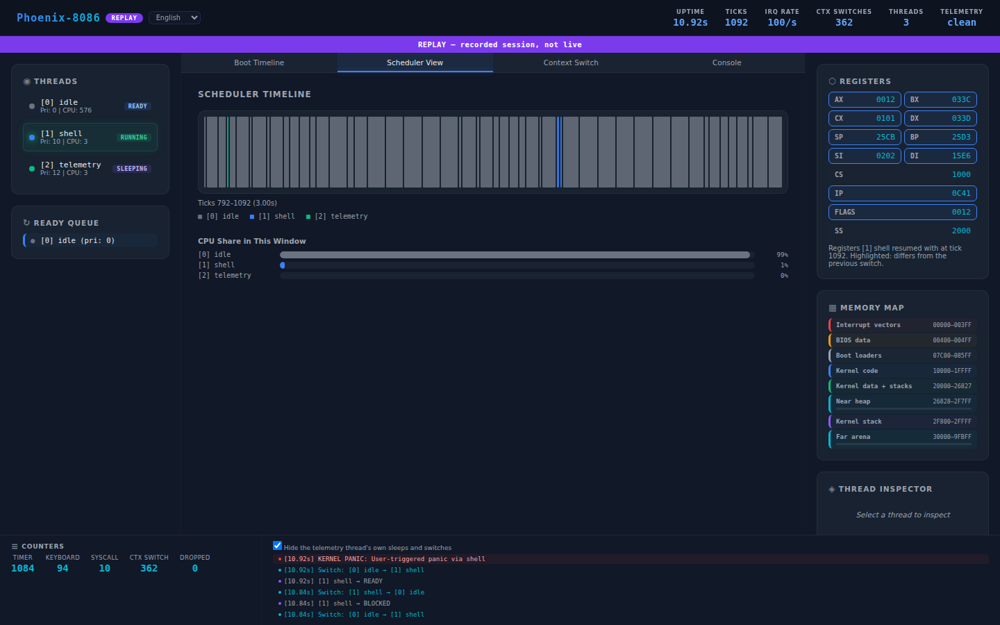

# Phoenix-8086 User Manual

Everything you need to use the kernel: starting it, every shell command, running and writing programs, the dashboard, and what to do when something goes wrong.

For how the kernel works inside, read the [architecture guide](architecture.md). For build details, read [Building and running](building.md).

**Contents**

1. [Before you start](#1-before-you-start)
2. [Starting and stopping](#2-starting-and-stopping), including [the screen](#the-screen)
3. [The shell](#3-the-shell)
4. [Command reference](#4-command-reference)
5. [Guided demos](#5-guided-demos)
6. [Files and programs](#6-files-and-programs)
7. [Writing your own program](#7-writing-your-own-program)
8. [The dashboard](#8-the-dashboard)
9. [Running in a web browser](#9-running-in-a-web-browser)
10. [Keyboard layouts](#10-keyboard-layouts)
11. [When things go wrong](#11-when-things-go-wrong)
12. [Quick reference card](#12-quick-reference-card)

---

## 1. Before you start

**What it is.** Phoenix-8086 is an operating system kernel for the Intel 8086. You do not install it on your computer. You run it inside an *emulator*, a program that imitates an old PC, and the kernel boots from a file that imitates a floppy disk.

**What you need.**

| | Required for |
| --- | --- |
| Linux on a 64-bit PC (Ubuntu 24.04, or WSL2 on Windows) | Everything |
| `make`, `nasm`, `python3`, `curl` | Building |
| `qemu-system-x86` | Running and testing |
| `dosbox-x` | `make test-8086` only |
| Python `websockets` package | The dashboard bridge only |
| Node.js 20 or later | Dashboard tests and the browser site only |

**Install and build.**

```sh
sudo apt install make nasm python3 curl qemu-system-x86
git clone https://github.com/khandakerCodes/PHOENIX_8086.git
cd PHOENIX_8086
make toolchain      # the 16-bit C compiler, into .toolchain/ (about 200 MB, no root needed)
make                # builds build/phoenix8086.img, the floppy image
```

## 2. Starting and stopping

| To… | Do this |
| --- | --- |
| Start the kernel in a window | `make run` |
| Stop it | Close the QEMU window, or press Ctrl+C in the terminal you started it from |
| Restart the kernel without closing the window | Type `reboot` at the prompt |
| Release the mouse if QEMU grabbed it | Ctrl+Alt+G |

When it starts you see the PHOENIX logo and the boot log. Each line with a dot is one part of the kernel coming up, and a check mark means it is ready:

```
  ● Boot drive ················   0x0000, 639 KB of memory
  ● Memory manager ············ ✓ 33704 bytes of near heap
  ● Keyboard ·················· ✓ us layout
  ● Scheduler ················· ✓ priorities, time slices, aging
  ● Interrupts ················ ✓ timer 100 Hz, keyboard, INT 80h
  ● Disk ······················ ✓ native floppy driver
  ● File system ··············· ✓ FAT12 mounted
  ● Shell ····················· ✓ thread 1

  ✓ Phoenix-8086 boot complete. All subsystems initialized.

  Type help for the commands, or try ps, stacks and run hello.bin.

phoenix> _
```

| Line | Meaning |
| --- | --- |
| `Boot drive 0x0000` | The kernel booted from the first floppy drive |
| `639 KB of memory` | How much memory the BIOS reported |
| `Disk ... native floppy driver` | The kernel talks to the floppy controller itself. On machines without one it says `BIOS INT 13h` |
| `File system ... FAT12 mounted` | The boot disk's files are available |

### The screen

<p align="center"></p>

| Part | What it shows |
| --- | --- |
| **Prompt** | The lilac `phoenix` pill. It means the shell is waiting for a command. (In text copies of a session, and to the dashboard, it is written `phoenix>`.) |
| **Panels** | Commands such as `ps`, `memory` and `ls` draw a panel with a title on the top border and, on the right, a note such as the number of threads |
| **Marks** | A green check (✓) is a success, a red cross (✗) a failure, a blue dot (●) information |
| **Meters** | A thick line shows how full or busy something is; the thin line behind it is the rest |
| **Status bar** | The bottom line, updated every second: time since boot, threads, free memory, the processor load over the last eight seconds as a sparkline, and the processor the kernel detected |

The colours are the Catppuccin Mocha palette. On a VGA the kernel loads them into the video hardware, and adds the rounded corners, pill ends, arrows and sparkline bars to the character set. On a CGA, as on the original IBM PC, it uses the sixteen standard colours and the nearest ordinary characters instead. Build with `make CONSOLE=plain` to see that look on a VGA.

## 3. The shell

The shell is the program you type into. It is itself a thread, with ID 1.

* Type a command and press **Enter**.
* **Backspace** deletes the last character. There is no cursor movement or history.
* Commands are lower case. A line can be up to 63 characters.
* File names are not case-sensitive: `run hello.bin` and `run HELLO.BIN` are the same.
* The prompt comes back as soon as a command has *started*. Threads and programs you start keep running and print whenever they have something to say, so their output can land in the middle of what you are typing. That is normal: it is several threads sharing one screen.

Words used below:

| Word | Meaning |
| --- | --- |
| **TID** | Thread ID, the number in the first column of `ps` |
| **Tick** | One timer interrupt. There are 100 per second |
| **Priority** | 0 to 255; higher runs first. The shell is 10, programs are 6 |

## 4. Command reference

### Getting around

| Command | What it does |
| --- | --- |
| `help` | Lists every command |
| `clear` | Clears the screen |
| `about` | Shows the version, thread count and uptime |
| `reboot` | Restarts the machine |

<p align="center"></p>

### Threads

| Command | What it does |
| --- | --- |
| `ps` or `threads` | Lists the threads |
| `create` | Starts a demo thread that prints a letter twenty times |
| `kill <tid>` | Stops a thread. Thread 0 cannot be killed |
| `nice <tid> <priority>` | Changes a thread's priority |
| `sleep <ticks>` | Puts the shell to sleep; `sleep 100` is one second |
| `scheduler` | Shows the running thread and those ready to run |
| `stacks` | Shows the deepest each thread's stacks have ever been used |

`ps` in detail:

```
phoenix> ps
 ╭─ Thread List ────────────────────────────────────────────────── 3 threads ─╮
 │ TID  NAME          STATE       PRI  CPU TICKS   SHARE OF CPU               │
 │ ────────────────────────────────────────────────────────────────────────── │
 │   0  idle          ● ready       0        164   ━━━━━━━━━━━━━━━━ 100%      │
 │   1  shell         ● running    10          0   ────────────────   0%      │
 │   2  telemetry     ● sleeping   12          0   ────────────────   0%      │
 ╰────────────────────────────────────────────────────────────────────────────╯
```

| Column | Meaning |
| --- | --- |
| State `running` (green) | Has the processor right now. In `ps` output that is always the shell |
| State `ready` (blue) | Wants the processor and is waiting its turn |
| State `blocked` (orange) | Waiting for something: a key, a message, a semaphore |
| State `sleeping` (grey) | Waiting for a time to pass |
| CPU TICKS | How many timer ticks the thread has been running for |
| SHARE OF CPU | Its share of all the ticks the threads in the list have used |

`stacks` in detail:

```
phoenix> stacks
 ╭─ Stack Use ──────────────────────────────────────── deepest so far, bytes ─╮
 │ TID  NAME          KERNEL STACK                PROGRAM STACK               │
 │ ────────────────────────────────────────────────────────────────────────── │
 │   0  idle           180 of 2048 ━───────────                               │
 │   1  shell          372 of 2048 ━━──────────                               │
 │   2  telemetry      246 of 2048 ━───────────                               │
 ╰────────────────────────────────────────────────────────────────────────────╯
```

<p align="center"></p>

Every stack is filled with a known pattern when its thread starts, so the kernel can tell how far down a thread has ever reached. A thread running a program has a second stack in the program's memory, shown in the last column. A stack that comes within 192 bytes of its end (64 for a program stack) is treated as overflowing and its thread is stopped. The figures only grow: run `selftest` and then `stacks` again, and the shell's number goes up.

Three threads are always there: `idle` (runs when nothing else does), `shell`, and `telemetry` (reports to the dashboard).

### Seeing inside the machine

| Command | What it does |
| --- | --- |
| `memory` | The memory map and how much is free |
| `stats` | Uptime and counters |
| `interrupts` | How many timer, keyboard and system-call interrupts there have been |
| `registers` | The processor's registers right now |
| `ticks` | Timer ticks since boot |
| `uptime` | Time since boot |
| `cpu` | Which processor family the kernel detects |
| `disk` | Which disk driver is in use |

`memory` in detail:

```
phoenix> memory
 ╭─ Memory Map ──────────────────────────────────────────── 639 KB of memory ─╮
 │ IVT             0x0000:0x0000 - 0x03FF           interrupt vectors         │
 │ BIOS Data       0x0000:0x0400 - 0x04FF                                     │
 │ Bootloader      0x0000:0x7C00                    stage 1, 512 bytes        │
 │ Stage 2         0x0000:0x7E00                    2048 bytes                │
 │ Kernel Code     0x1000:0x0000                    64 KB segment             │
 │ Kernel Data     0x2000:0x0000 - 0x7457           data and BSS              │
 │ Near Heap       0x2000:0x7458 - 0xF7FF           kmalloc                   │
 │ Kernel Stack    0x2000:0xF800 - 0xFFFF                                     │
 │ Far Arena       0x3000:0x0000 - 0x9FC0:0x0000    programs, far_alloc       │
 │ ────────────────────────────────────────────────────────────────────────── │
 │ Heap free:   29092 bytes  ━━━━──────────────────────────  13% used         │
 │ Heap used:    4612 bytes                                                   │
 │ Far free:      446 KB     ━─────────────────────────────   0% used         │
 ╰────────────────────────────────────────────────────────────────────────────╯
```

<p align="center"></p>

Addresses are written `segment:offset`. The **near heap** is the kernel's own small pool of memory. The **far arena** is the rest of the machine's memory, which programs are loaded into. If "Far free" is lower after a program has finished than before it started, something leaked.

`cpu` answers `80286 or later` in QEMU and `8086/8088` on an emulated 8086. `disk native` and `disk bios` switch disk drivers; you will rarely need to.

### Demonstrations

| Command | What it shows |
| --- | --- |
| `create` | Preemptive multitasking |
| `ipc` | Two threads passing messages through a mailbox |
| `syscall` | A thread using only system calls |
| `bench` | How many context switches and memory allocations fit in a second, and how long the timer interrupt takes to reach its handler |
| `selftest` | The kernel testing itself |
| `overflow` | A stack overflow being caught |
| `divzero` | A divide-by-zero, which ends in a panic |
| `panic` | The panic report |

`divzero` and `panic` halt the kernel on purpose. Restart it afterwards.

### Files and programs

| Command | What it does |
| --- | --- |
| `ls` | Lists the files on the boot disk |
| `cat <file>` | Prints a text file |
| `run <file>` | Loads a program and starts it as a thread |

### Keyboard

| Command | What it does |
| --- | --- |
| `keymap` | Lists the layouts; the green dot marks the one in use |
| `keymap <name>` | Switches layout: `us`, `uk`, `de`, `fr` |

## 5. Guided demos

### Multitasking

```
phoenix> create
phoenix> create
phoenix> create
```

Do it quickly. Three threads, `demo-A`, `demo-B` and `demo-C`, each print their letter in their own colour. They have priorities 5, 3 and 4. A strict priority system would let A finish before C starts, and C before B. Instead you see them mixed, because a thread that waits gains priority over time. Type `ps` while they run to see their CPU ticks grow.

Try `nice 3 1` while `demo-A` (usually TID 3) is running, and watch it fall behind.

### Message passing

```
phoenix> ipc
[recv 1][recv 2][recv 3][recv 4][recv 5][ipc done]
```

A *producer* thread sends the numbers 1 to 5 into a mailbox, pausing between each. A *consumer* thread receives them. When the mailbox is empty the consumer is `BLOCKED`, using no processor time, until the next message arrives.

### System calls

```
phoenix> syscall
[v1][slept 20 ticks][syscall done]
```

This thread does everything through `INT 80h`: it asks for the interface version (`v1`), sleeps 20 ticks and measures that it really was 20, prints, and exits.

### Self-test

```
phoenix> selftest
  ✓ selftest: 79 passed, 0 failed
```

The kernel checks its own memory allocators, semaphores, mutexes (including priority inheritance), mailboxes, timer, system calls, keyboard layouts and file system. If anything fails it names the check. Run this first if the kernel behaves strangely.

### Catching a runaway thread

```
phoenix> overflow
  ✓ Created thread TID=3

  ✗ STACK OVERFLOW: Thread 3 (overflow) stopped
```

The thread calls itself forever. Every thread's stack is checked each time the kernel switches threads, and this one is stopped before its stack runs into its neighbour's. The shell is unaffected.

## 6. Files and programs

The boot floppy is a standard FAT12 disk with these files on it:

| File | What it is |
| --- | --- |
| `README.TXT` | A short text file. Try `cat readme.txt` |
| `HELLO.BIN` | Prints a greeting |
| `PRIMES.BIN` | Counts the primes below 1000 |
| `CLOCK.BIN` | Sleeps, measures the time, and reads a file |
| `THREADS.BIN` | Starts two worker threads that send numbers to the main thread |
| `WHERE.BIN` | Shows which memory segments it was loaded into and uses 50 KB |
| `GREET.BIN` | Asks you for a key, then counts to three |
| `ROGUE.BIN` | Breaks the rules on purpose: bad system-call arguments, then a stack overflow |

Run one with `run`:

```
phoenix> run primes.bin
  ✓ Started primes.bin as TID=3
primes below 1000: 168
largest 997
last digit seven
```

A program runs as a thread, so you can start several at once, see them in `ps`, and stop one with `kill`. When a program ends, its memory is returned; check with `memory` before and after.

`greet.bin` asks for a key. While a program is waiting for a key, your next key press goes to it and not to the shell.

`rogue.bin` shows what the kernel notices when a program misbehaves:

```
phoenix> run rogue.bin
  ✓ Started rogue.bin as TID=3
rogue: 9 of 9 bad calls refused
rogue: now overflowing my own stack

  ✗ PROGRAM STACK OVERFLOW: Thread 3 (rogue) stopped
```

It passes the kernel pointers outside its own memory, a made-up semaphore handle, the kernel's own memory to free, and a thread start address outside its code; every one of those calls fails. Then it recurses until its stack runs out and is stopped. The 8086 cannot stop a program from writing anywhere it likes, so this is detection, not protection: the kernel refuses to do damage on a program's behalf and notices a runaway stack at the next thread switch.

**Putting your own files on the disk.** The disk image is an ordinary FAT12 volume, so standard tools can write to it. With mtools installed:

```sh
mcopy -i build/phoenix8086.img notes.txt ::NOTES.TXT
```

File names must be in the old 8.3 form: up to eight characters, a dot, up to three. Rebuilding with `make` recreates the image, so copy your files again afterwards, or add them to `DISK_FILES` in the `Makefile`.

## 7. Writing your own program

1. **Copy an example.**

   ```sh
   cp sdk/examples/greet.c sdk/examples/mine.c
   ```

2. **Edit `sdk/examples/mine.c`.** A program is a `main` function that calls the kernel through the functions in `sdk/include/phoenix.h`:

   | Function | What it does |
   | --- | --- |
   | `px_putc(c)`, `px_puts(s)` | Print a character or a string |
   | `px_getc()` | Wait for a key |
   | `px_sleep(ticks)` | Sleep; `PX_HZ` is one second |
   | `px_ticks()` | Ticks since boot |
   | `px_thread_create(function, priority)` | Start another thread in this program |
   | `px_sem_create`, `px_sem_wait`, `px_sem_signal`, `px_sem_destroy` | Semaphores |
   | `px_mbox_create`, `px_mbox_send`, `px_mbox_recv`, `px_mbox_destroy` | Mailboxes |
   | `px_alloc(paragraphs)`, `px_free(segment)` | Extra memory |
   | `px_open`, `px_read`, `px_close` | Read a file from the boot disk |
   | `px_exec(name)` | Start another program |
   | `px_exit()` | End this thread |

3. **Add it to the build.** In the `Makefile`, add `mine` to `PROGRAM_NAMES`.

4. **Build and run.**

   ```sh
   make run
   ```
   ```
   phoenix> run mine.bin
   ```

Things to know:

* There is no C library: no `printf`, no `malloc`, no `strlen`. Write what you need, as the examples do.
* `int` is 16 bits and `long` is 32 bits.
* Each thread has a 2 KB stack. Make big arrays `static`.
* One array cannot be larger than 32,767 bytes. A program can have about 56 KB of data in total.
* `make check` verifies that your program uses only 8086 instructions.

More detail, including how programs are loaded, is in [Writing programs](programs.md). The system calls themselves are in [System calls](syscalls.md).

## 8. The dashboard

The dashboard is a web page that shows what the kernel is doing.

```sh
pip install -r bridge/requirements.txt
./phoenix.sh
```

Then open <http://localhost:8080>. The script starts three things: QEMU with the kernel, a *bridge* that reads the kernel's serial port, and a small web server. Press Ctrl+C in that terminal to stop all three.

### Reading the page

<p align="center"></p>

| Area | What it shows |
| --- | --- |
| **Top bar** | Uptime, ticks, timer rate, context switches, thread count, and the health of the telemetry link |
| **Badge and banner** | Where the data comes from: `LIVE`, `REPLAY`, `IN BROWSER`, `DEMO` or `OFFLINE` |
| **Threads** (left) | Every thread with its state. Click one to inspect it |
| **Ready queue** (left) | Threads waiting for the processor, highest priority first |
| **Boot Timeline** tab | The boot stages the kernel reported |
| **Scheduler View** tab | Who ran when, over the last three seconds, and each thread's share |
| **Context Switch** tab | The most recent switch: from which thread to which |
| **Console** tab | The kernel's console text, with a box to type commands into. Panels and marks appear in ordinary code-page-437 characters (`■` for a dot, `√` for a check); the colours, the prompt pill and the status bar exist only on the kernel's own screen |
| **Registers** (right) | The registers the most recently resumed thread started with |
| **Memory Map** (right) | The kernel's actual memory layout, with usage bars |
| **Thread Inspector** (right) | Details of the thread you clicked, including how deep its stacks have been used |
| **Counters and events** (bottom) | Interrupt counts and a log of what happened |

"Telemetry: clean" means no records were damaged, lost or dropped. If the kernel's buffer overflows (the `bench` command does this), the **Dropped** counter says how many records were lost; the page never fills the gap with invented data.

The language menu in the top bar switches between English, German, French, Spanish and Arabic.

### Recording and replaying

```sh
# Record a scripted session without the dashboard
python3 tools/record_session.py build/phoenix8086.img session.jsonl

# Play it back at double speed
python3 bridge/serial_ws_bridge.py --replay session.jsonl --speed 2
make dashboard          # in another terminal, then open http://localhost:8080
```

The badge says `REPLAY` so nobody mistakes it for a live kernel.

## 9. Running in a web browser

The whole system can run inside a web page, using an emulator written for browsers.

```sh
make
./tools/build_site.sh
python3 -m http.server 8080 --directory site
```

Open <http://localhost:8080>. The badge says `IN BROWSER`, the kernel boots in a few seconds, and the Console tab lets you type commands. Building the site needs `npm`.

This runs the same floppy image as QEMU does. The browser emulator imitates a 386-class PC, so `cpu` answers `80286 or later` here too.

## 10. Keyboard layouts

```
phoenix> keymap
  ● us    United States (QWERTY)  (in use)
  ● uk    United Kingdom (QWERTY)
  ● de    German (QWERTZ)
  ● fr    French (AZERTY)
phoenix> keymap de
  ✓ Keymap: de
```

A layout tells the kernel which character each *key position* produces. Choose the one that matches the keyboard you are typing on.

* **Shift** and **Caps Lock** work as usual.
* **AltGr** (the right Alt key) gives the third character on European layouts, for example `@` on AltGr+Q in the German layout.
* Accented letters use the PC's original character set, so only the characters in that set are available.

If you switch to a layout that does not match your keyboard, the letters on your keys no longer match what appears. To get back, type the command using the *positions* of the keys: on a US keyboard in the German layout, Y and Z are swapped, so type `kezmap us`.

## 11. When things go wrong

### The panic report

A panic means the kernel hit something it cannot recover from and has stopped. The screen shows a report, and the status bar turns red and says **HALTED**.

<p align="center"></p>

```
  KERNEL PANIC   User-triggered panic via shell

 ╭─ Where ────────────────────────────────────────────────────────────────────╮
 │ Current Thread: TID=1  Name=shell  State=1                                 │
 │ Timer ticks:               188       Context switches:           44        │
 ╰────────────────────────────────────────────────────────────────────────────╯
 ╭─ Register Dump ─────────────────────────────── at the moment of the panic ─╮
 │ AX=0x0CAA       BX=0x1063       CX=0x0608       DX=0xFFFF                  │
 │ SP=0x2E79       BP=0x2E79       SI=0x2EAE       DI=0x2EA9                  │
 │ CS=0x1000       IP=0x4E6A       FLAGS=0x0002                               │
 │ DS=0x2000       ES=0x0B33       SS=0x2000                                  │
 ╰────────────────────────────────────────────────────────────────────────────╯

  ● System halted. Press RESET to restart. Look the IP up with: make disasm
```

| Field | Use |
| --- | --- |
| **The red pill** | What happened |
| **Current Thread** | Which thread was running |
| **CS:IP** | Where in the code it happened. `CS=0x1000` is the kernel; another value is a program |
| **Other registers** | The processor's state at that instant |

To find the code, look `IP` up in the kernel's disassembly. Addresses in the left column are offsets in the kernel's code segment, the same numbers `IP` shows:

```sh
make disasm | less
```

Restart with `make run`.

### Troubleshooting

| Problem | Likely cause and fix |
| --- | --- |
| `ERROR: ... ia16-elf-gcc not found` | Run `make toolchain` |
| `make toolchain` fails | It needs Ubuntu 24.04 packages. On another system install `gcc-ia16-elf` yourself; see [Building and running](building.md) |
| QEMU window does not open | No graphical display (for example over SSH). Use `make test`, which runs without a window |
| The screen shows `BAD KERNEL IMAGE` | The disk image is damaged. Run `make clean && make` |
| Keys produce the wrong characters | The layout does not match your keyboard. See [Keyboard layouts](#10-keyboard-layouts) |
| My typing is mixed with other output | Threads share the screen. Wait for them to finish, or `clear` |
| `Error: No free thread slots` | At most eight threads exist at once, three of them permanent. Wait, or `kill` one |
| `Cannot run X: not a Phoenix-8086 program` | The file was not built with the SDK, or with an older version of it. Rebuild with `make` |
| `Cannot run X: out of memory` | Check `memory`. A program may still be running; `ps` shows it |
| `phoenix.sh` says a port is in use | Something else is using port 8080, 9090 or 9876. Stop it and try again |
| Dashboard says `OFFLINE` | The bridge is not running. Start everything with `./phoenix.sh` |
| Dashboard says "waiting for the kernel" | The bridge is up but QEMU is not, or QEMU's serial port is not on TCP port 9876 |
| The kernel seems stuck | Run `make test`. If that passes, the kernel is fine and something in your session is waiting |

If you think you have found a bug, the [contributing guide](../CONTRIBUTING.md) says what to include in a report.

## 12. Quick reference card

```
SCREEN              ✓ success   ✗ failure   ● information   ━━── meter
                    status bar: uptime | threads | free memory | load | CPU

STARTING            make run            boot in a window
                    make test           build and test everything
                    ./phoenix.sh        kernel + dashboard

THREADS             ps                  list threads
                    stacks              deepest stack use
                    create              start a demo thread
                    kill <tid>          stop a thread
                    nice <tid> <pri>    change priority

FILES               ls                  list files
                    cat <file>          print a text file
                    run <file>          run a program

LOOK INSIDE         memory  stats  interrupts  registers  scheduler
                    ticks   uptime cpu         disk       stacks   about

DEMOS               ipc  syscall  bench  selftest  overflow

HALTS THE KERNEL    panic  divzero

OTHER               help  clear  reboot  sleep <ticks>  keymap [us|uk|de|fr]
```
